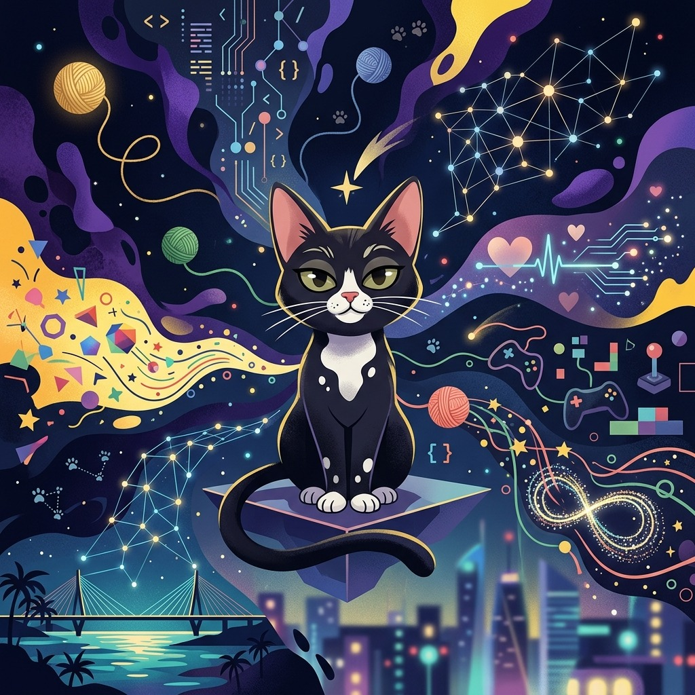
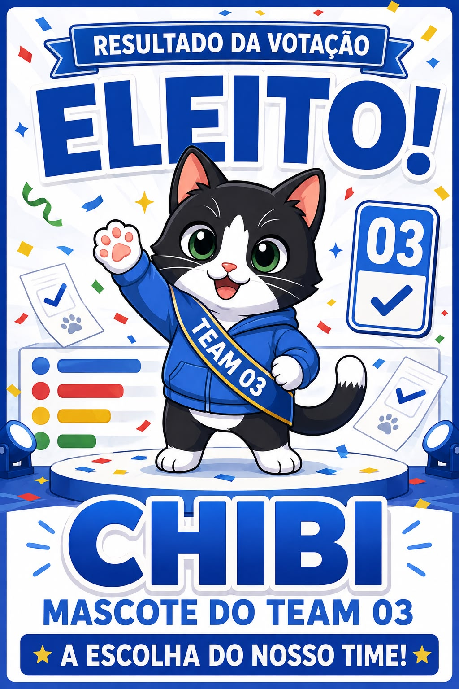
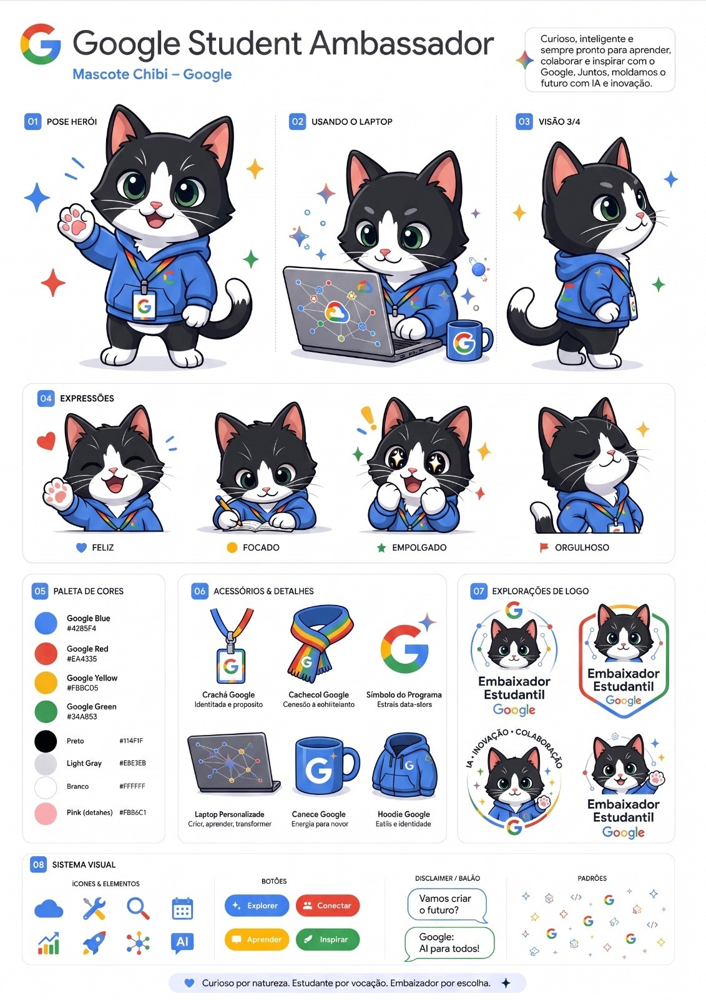

<div align="center">

## 🐈‍⬛ Miau na área!

### Conheça quem roubou a cena logo no começo da missão

*Entre IA, tecnologia, criatividade e alguns novelos de lã,*  
*Batman assumiu oficialmente o cargo de porta-voz não oficial desta jornada.* 😼🚀

<br>

**🐾 Batman — Supervisor de Projetos • Fiscal de Reuniões • Especialista em Teclados**

</div>

# 🐱✨ Gemini em Missão

<div align="center">

### Minha jornada como Embaixadora Estudantil do Google 2026

**Inteligência Artificial • Aprendizado • Impacto • Criação • Comunidade • Evolução**

<br>

> Um diário de bordo sobre o que me foi proposto, o que eu fiz,  
> o que criei com Inteligência Artificial e como evoluí ao longo da jornada.

<br>

[](https://github.com/SouBeatrizKaroline)
[](https://www.linkedin.com/in/beatrizkcs/)
[](https://soubeatrizkaroline.goskip.app/)

<br>

`🤖 Gemini` `🎓 Educação` `💻 Tecnologia` `🎨 Criatividade`
`🌎 Impacto` `🧠 Aprendizado`

</div>

---

# 🌟 Sobre o Gemini em Missão

O **Gemini em Missão** é o meu diário público de evolução durante a jornada como **Embaixadora Estudantil do Google 2026**.

A proposta deste repositório não é apenas registrar que uma atividade foi concluída.

Quero documentar o caminho inteiro:

- 🎯 o que foi proposto;
- 📋 como a atividade deveria ser feita;
- 💭 como interpretei o desafio;
- 💬 o que respondi;
- 🤖 como utilizei o Gemini;
- ✨ o que produzi;
- 📸 evidências reais, quando existirem;
- 🌐 publicações públicas, quando existirem;
- 🧠 o que aprendi;
- 🔄 o que faria diferente;
- 📈 como aquele aprendizado evoluiu depois.

Algumas atividades tiveram **mais de uma resposta ou entrega**. Quando isso acontecer, todas podem ser registradas.

> **Regra deste README:** uma atividade só recebe imagem, vídeo, prompt, link ou métrica quando esse material realmente existe e foi recuperado. Não uso elementos visuais apenas para preencher espaço.

---

# 🔐 Sobre privacidade

Este repositório é **público**.

Por isso, algumas informações utilizadas dentro da comunidade não são reproduzidas aqui.

Não publico:

- links internos do programa;
- formulários de presença;
- check-ins e check-outs privados;
- links de RSVP;
- painéis restritos;
- dados pessoais de outros participantes;
- telefones ou contatos internos;
- códigos e benefícios individuais;
- documentos de circulação restrita.

Quando uma atividade depende de algum desses recursos, registro apenas:

> **o que precisava ser feito + o que eu fiz + o resultado da minha experiência.**

---

# 🧭 Como este README funciona

O README foi organizado para funcionar como um **diário de bordo navegável**.

As semanas permanecem visíveis para mostrar a evolução da jornada. Cada desafio, sessão, ação de impacto ou experiência pode ser **aberta e fechada individualmente**.

> 💡 **Como navegar:** use o sumário para ir direto a uma atividade e clique no título dela para abrir ou recolher o conteúdo.

Sempre que fizer sentido, as atividades seguem este fluxo:

```text
📅 DATA / ETAPA
      ↓
🎯 O QUE FOI PROPOSTO
      ↓
📋 COMO FAZER
      ↓
🚀 O QUE EU FIZ
      ↓
💬 RESPOSTAS / ENTREGAS
      ↓
🤖 GEMINI EM AÇÃO
      ↓
✨ RESULTADO
      ↓
📸 EVIDÊNCIA / 🌐 PUBLICAÇÃO — SE EXISTIR
      ↓
🧠 APRENDIZADOS
      ↓
🔄 MELHORIAS / 📈 EVOLUÇÃO
```

Nem toda atividade precisa conter todas essas partes. O README prioriza **fidelidade ao que realmente aconteceu**, e não o preenchimento artificial de um modelo.

---

<a id="sumario"></a>

# ⚡ Sumário da Jornada

- [🗺️ Linha do Tempo](#linha-do-tempo)
- [🌱 Onboarding](#onboarding)
  - [🌐 14/08 — Entrada na comunidade](#onboarding-entrada)
  - [🤝 15/08 — Conexões e networking](#onboarding-networking)
  - [🐱 16/08 — Quebra-gelo criativo](#onboarding-quebra-gelo)
  - [📢 16–18/08 — Compartilhando a conquista](#onboarding-conquista)
  - [🚀 21/08 — Encontro de lançamento](#onboarding-lancamento)
- [🤖 Semana 1 — Meu jeito de trabalhar com IA](#semana-1)
  - [🛠️ Preparação](#semana1-preparacao)
  - [🐱🎨 Chibi — Identidade do Team 03](#semana1-chibi)
  - [🧠 Desafio #01 — Auditoria de Prompt](#semana1-auditoria-prompt)
  - [💎 Explorando recursos avançados](#semana1-recursos-avancados)
  - [📚 Sessão Gemini #01 — Study Notebooks](#semana1-study-notebooks)
  - [🏁 Retrospectiva](#semana1-retrospectiva)
- [🌎 Semana 2 — Onde a IA pode expandir possibilidades?](#semana-2)
  - [🗺️ Desafio #01 — Meu Mapa de Impacto](#semana2-mapa-impacto)
  - [🕵️ Missão Embaixadora em Campo](#semana2-embaixadora-campo)
  - [📡 Radar de Oportunidades](#semana2-radar-oportunidades)
  - [💻 Sessão Gemini #02 — Canvas + Bases de Dados](#semana2-canvas-bases)
  - [🎙️ Ação de Impacto — Do Campo ao Conteúdo](#semana2-campo-conteudo)
  - [🏁 Retrospectiva](#semana2-retrospectiva)
- [🧠 Semana 3 — Aprendizagem visual e interativa](#semana-3)
  - [💬 Desafio #01 — Onde está o seu desafio?](#semana3-onde-desafio)
  - [🎨 Desafio #02 — Transforme seu desafio](#semana3-transforme-desafio)
  - [🧩 Sessão Gemini #03 — Visualizações Interativas](#semana3-visualizacoes)
  - [🎬 Ação de Impacto — Minha Semana em Vídeo](#semana3-video-omni)
- [💬 Evolução dos Prompts](#evolucao-prompts)
- [🎥 Conteúdos e Projetos Públicos](#conteudos-publicacoes)
- [📈 Minha Evolução](#minha-evolucao)
- [🏆 Marcos da Jornada](#marcos)
- [📝 Modelo das próximas atividades](#modelo-atividades)
- [📸 Política de evidências](#politica-evidencias)

---

<a id="linha-do-tempo"></a>

## 🗺️ Linha do Tempo

| Data | Etapa | Missão / Atividade | Tipo | Status |
|---|---|---|---|:---:|
| 14/08/2026 | Onboarding | Entrada na comunidade | 🌱 Marco | ✅ |
| 15/08/2026 | Onboarding | Conexões e networking | 🤝 Iniciativa | ✅ |
| 16/08/2026 | Onboarding | Quebra-gelo criativo | 🎨 Atividade | ✅ |
| 16–18/08/2026 | Onboarding | Compartilhando a conquista | 📢 Impacto | ✅ |
| 21/08/2026 | Onboarding | Encontro de lançamento | 🚀 Encontro | ✅ |
| 24–31/08/2026 | Semana 1 | Meu jeito de trabalhar com IA | 🤖 Ciclo | ✅ |
| 25/08/2026 | Semana 1 | Auditoria de Prompt | 🧠 Desafio | ✅ |
| 28/08/2026 | Semana 1 | Study Notebooks | 📚 Sessão | ✅ participação |
| 01/09/2026 | Semana 2 | Meu Mapa de Impacto | 🗺️ Desafio | ✅ |
| 02–03/09/2026 | Semana 2 | Embaixadora em Campo | 🕵️ Investigação | ✅ |
| 03/09/2026 | Semana 2 | Radar de Oportunidades | 📡 Desafio | ✅ |
| 04/09/2026 | Semana 2 | Canvas + Bases de Dados | 💻 Sessão | ✅ participação |
| 04/09/2026 | Semana 2 | Do Campo ao Conteúdo | 🎙️ Impacto | ✅ |
| 08/09/2026 | Semana 3 | Onde está o seu desafio? | 💬 Desafio | ✅ |
| 09/09/2026 | Semana 3 | Transforme seu desafio | 🎨 Desafio | 📝 A documentar |
| 10/09/2026 | Semana 3 | Visualizações Interativas | 🧩 Sessão | 📝 A documentar |
| 11/09/2026 | Semana 3 | Minha Semana em Vídeo | 🎬 Impacto | 📝 A documentar |
| Em breve | Próxima etapa | Nova missão... | 🚀 | ⏳ |

---

<a id="onboarding"></a>

# 🌱 ONBOARDING

### 14 a 23 de agosto de 2026

> **Conhecer • Conectar • Compartilhar • Preparar**

O início da jornada foi dedicado à entrada na comunidade, às primeiras conexões e à construção da nossa presença como Embaixadores e Embaixadoras.

---

### 🧭 Nesta etapa

| Data | Registro |
|---|---|
| 14/08 | [🌐 Entrada na comunidade](#onboarding-entrada) |
| 15/08 | [🤝 Conexões e networking](#onboarding-networking) |
| 16/08 | [🐱 Quebra-gelo criativo](#onboarding-quebra-gelo) |
| 16–18/08 | [📢 Compartilhando a conquista](#onboarding-conquista) |
| 21/08 | [🚀 Encontro de lançamento](#onboarding-lancamento) |

> **Clique em qualquer atividade para abrir ou recolher o conteúdo completo.**

---

<a id="onboarding-entrada"></a>

<details>
<summary><strong>🌐 14/08 — Entrada na comunidade</strong></summary>

<br>


### 🎯 O que foi proposto

Entrar na comunidade oficial e conhecer sua dinâmica.

O espaço seria utilizado principalmente para:

- trocar conhecimentos;
- conversar sobre estudos e carreira;
- compartilhar experiências com Gemini;
- aprender engenharia de prompts;
- acompanhar desafios;
- colaborar com outros estudantes;
- desenvolver liderança;
- levar o conhecimento para além do grupo.

### 🚀 O que eu fiz

Comecei acompanhando as conversas e conhecendo participantes de diferentes áreas.

A partir dali, passei a compartilhar um pouco da minha trajetória e experiências com tecnologia, projetos, comunidades e hackathons.

### 🧠 Primeira percepção

> Logo nos primeiros dias, percebi que essa jornada não seria apenas sobre aprender a utilizar o Gemini ou explorar novas ferramentas de IA. A comunidade também fazia parte da experiência.
>
> Encontrar estudantes de diferentes cursos, regiões, experiências e interesses me fez enxergar o programa como um espaço para **trocar conhecimento, criar conexões e transformar interesses em possíveis colaborações**.
>
> Minha primeira reação foi justamente tentar conhecer melhor as pessoas: entender o que cada uma estudava, o que sabia compartilhar, o que queria aprender e quais interesses poderiam aproximá-las.
>
> Foi daí que surgiu uma das minhas primeiras iniciativas espontâneas dentro da comunidade — e também um dos primeiros aprendizados da jornada: **tecnologia conecta ferramentas, mas são as pessoas, seus contextos e suas necessidades que dão sentido ao que construímos.**

---

[⬆️ Voltar ao sumário](#sumario)

</details>

---
<a id="onboarding-networking"></a>

<details>
<summary><strong>🤝 15/08 — Conexões e networking</strong></summary>

<br>


### 🎯 O contexto

Com a abertura da comunidade para interação, começamos a conhecer estudantes de diferentes cursos, áreas e regiões.

As conversas passaram rapidamente por:

`💻 Desenvolvimento` `🎮 Jogos` `🏆 Hackathons`
`🎨 Criatividade` `📚 Estudos` `🌎 Idiomas`
`🚀 Carreira` `🤝 Comunidades`

### 💬 Algumas coisas que compartilhei

Falei sobre minha relação com tecnologia e hackathons e sobre como gosto de experiências multidisciplinares.

Uma das ideias que compartilhei foi:

> **“A dica é: não se apegue à solução e sim ao problema.”**
>
> Isso ajuda a pensar em soluções melhores e mais definidas.

Também contei que já havia participado de hackathons nacionais e internacionais e que, no início, utilizava as ferramentas que tinha disponíveis para conseguir participar.

---

## 🌐 Iniciativa espontânea — Networking entre participantes

### 💡 De onde surgiu

Durante as conversas, percebi que várias pessoas tinham interesse em:

- encontrar colegas da mesma área;
- descobrir quem poderia ensinar determinado assunto;
- encontrar pessoas interessadas em aprender algo;
- compartilhar projetos;
- trocar redes sociais;
- criar novas conexões.

Então surgiu a ideia de facilitar esse networking.

### 🚀 O que eu fiz

Criei uma iniciativa **não oficial e voluntária** de organização de contatos e interesses.

A proposta permitia que cada pessoa escolhesse se queria compartilhar:

- 🎓 área de estudo ou atuação;
- 💡 conhecimentos que poderia ensinar;
- 🌱 assuntos que gostaria de aprender;
- 🎮 interesses;
- 🌐 redes e comunidades;
- 💬 observações e ideias.

### ✍️ Texto que escrevi

<details>
<summary><strong>💬 Ver o texto que enviei</strong></summary>

> Fala, pessoal! 👋✨
>
> Agora que o grupo foi reaberto, estou compartilhando uma planilha para quem quiser conhecer melhor os colegas, trocar redes sociais, divulgar projetos e fortalecer nosso networking.
>
> Além das redes sociais, vocês podem compartilhar:
>
> 🎓 Área de estudo ou atuação  
> 💡 Conhecimentos que podem ensinar ou compartilhar  
> 🌱 Assuntos que gostariam de aprender  
> 🎮 Nick de jogos  
> 🌐 Outras redes e comunidades  
> 💬 Observações, ideias e interesses
>
> A ideia é facilitar conexões entre pessoas que possam aprender, ensinar, criar projetos e se ajudar durante o programa.
>
> Preencham apenas os campos que fizerem sentido — não é necessário completar tudo.
>
> ⚠️ Esta é uma iniciativa **não oficial**, criada informalmente entre participantes.
>
> 🔒 O preenchimento é totalmente voluntário. Compartilhe somente dados, perfis e informações com os quais você se sentir confortável.
>
> Vamos aproveitar esse espaço com responsabilidade, respeito e cuidado para construir conexões incríveis e ajudar uns aos outros! 💙🚀

</details>

> 🔐 O link original não é publicado aqui porque a iniciativa tinha circulação restrita.

### 🧠 O que aprendi

Essa iniciativa me ensinou que **facilitar conexões entre pessoas também exige pensar em segurança, privacidade e contexto**.

A intenção inicial era simples: tornar mais fácil descobrir pessoas com interesses, conhecimentos e objetivos em comum. Mas, ao longo da experiência, percebi que qualquer mecanismo de networking também envolve decisões sobre:

- quais informações realmente precisam ser compartilhadas;
- quem pode acessar essas informações;
- por quanto tempo elas devem permanecer disponíveis;
- como deixar claro que a participação é opcional;
- como evitar exposição desnecessária;
- como equilibrar descoberta, colaboração e segurança.

Também percebi que existe uma tensão real entre **visibilidade e privacidade**.

Em comunidades, projetos, carreira e criação de conteúdo, alguma exposição pode facilitar encontros, oportunidades e colaborações. Ao mesmo tempo, quanto mais informações ficam concentradas ou organizadas em um único lugar, maior precisa ser o cuidado com acesso, consentimento e finalidade.

Foi uma experiência que me fez pensar de forma mais crítica sobre tecnologia e comunidade:

> **não basta perguntar “isso conecta pessoas?” — também é preciso perguntar “isso conecta de forma segura, consciente e responsável?”**

### 📈 Evolução

**Conexões que surgiram:**  
A iniciativa ajudou a estimular conversas sobre interesses, áreas de atuação, conhecimentos e possibilidades de colaboração entre participantes.

Mais importante do que contabilizar conexões específicas foi perceber que existia uma demanda real por mecanismos que facilitassem descobrir **quem está interessado em quê** dentro de uma comunidade grande.

**Projetos ou conversas que nasceram disso:**  
A experiência gerou principalmente uma discussão mais ampla sobre como criar espaços de networking que sejam úteis sem depender de exposição excessiva de informações pessoais.

Isso acabou transformando uma iniciativa simples de organização de contatos em uma reflexão sobre:

`comunidade` → `descoberta` → `privacidade` → `confiança` → `responsabilidade`

**O que faria diferente hoje:**  
Hoje eu começaria pela privacidade e pelo desenho do fluxo antes de pensar na planilha ou na ferramenta.

Em vez de concentrar informações pessoais em uma base compartilhada, eu exploraria alternativas como:

- perfis com informações mínimas e opcionais;
- interesses representados por tags;
- busca por temas ou habilidades sem exibir todos os dados;
- conexões mediadas por interesse mútuo;
- acesso restrito e com finalidade definida;
- informações com prazo de validade;
- possibilidade simples de editar ou remover dados;
- orientações claras sobre o que é seguro compartilhar.

A principal mudança seria aplicar uma lógica de **privacy by design** desde o início: coletar o mínimo necessário e criar a experiência de networking em torno das pessoas, e não em torno da quantidade de dados disponíveis.

---

[⬆️ Voltar ao sumário](#sumario)

</details>

---
<a id="onboarding-quebra-gelo"></a>

<details>
<summary><strong>🐱 16/08 — Quebra-gelo criativo</strong></summary>

<br>


### 🎯 O que foi proposto

Criar uma apresentação pessoal criativa utilizando o **Google Gemini**.

A atividade tinha três partes principais.

### 📋 Como fazer

**1. Criar uma imagem**

A proposta era criar uma imagem com Gemini que representasse:

- personalidade;
- trajetória;
- interesses;
- propósito.

Como o espaço não permitia fotos pessoais, a recomendação era explorar:

- avatares;
- ilustrações;
- personagens;
- imagens criativas;
- representações simbólicas.

**2. Compartilhar a imagem**

Salvar a imagem gerada e apresentá-la ao grupo.

**3. Se apresentar junto com a imagem**

A mensagem deveria incluir:

1. nome;
2. curso e universidade;
3. breve resumo do motivo de participar da jornada.

Depois da própria apresentação, a ideia era interagir com as apresentações dos colegas.

---

# 🚀 O que eu fiz

Em vez de criar apenas uma apresentação tradicional, fiz **duas respostas complementares**.

Na primeira, transformei meu gato **Batman** no narrador.

Na segunda, fiz uma apresentação direta.

---

## 🐈‍⬛ Resposta #01 — Batman apresenta Beatriz

<details>
<summary><strong>🐾 Abrir minha apresentação completa</strong></summary>

> 🐾 **Miau, Embaixadores! Permitam-me fazer as apresentações…**
>
> Meu nome é **Batman**. 🐈‍⬛🤍  
> Tenho **6 anos**, sou um respeitável gato frajola, supervisor oficial de projetos, fiscal de reuniões, especialista em deitar em cima do teclado e, aparentemente, fui promovido a porta-voz da minha humana.
>
> Sim, porque hoje quem vai apresentar a **Beatriz Karoline** sou eu. 😼
>
> E já aviso: **não tentem entender a trajetória dela olhando apenas para os nomes dos cursos.** Eu tentei. Depois percebi que existe método no caos. 😂
>
> Minha humana é **formada em Enfermagem pela UFPE**, fez **Edificações pelo SENAI**, passou por algumas disciplinas do **Técnico em Mecânica** e também é **Tecnóloga em Análise e Desenvolvimento de Sistemas pela UNINASSAU**.
>
> E ela decidiu que isso ainda era pouco.
>
> Na época dessa apresentação, também estava explorando outras formações e áreas de conhecimento. 🗺️💻📐📊
>
> Agora vocês podem estar pensando:
>
> **“Batman… mas o que Enfermagem, Edificações, Mecânica, Programação, Cartografia e Marketing têm a ver uma coisa com a outra?”**
>
> 😼 Excelente pergunta, humanos.
>
> À primeira vista, parece que ela simplesmente abriu o catálogo de cursos e pensou: *“sim”*. 😂
>
> Mas é justamente aí que está uma das coisas mais legais sobre ela: **Beatriz consegue juntar formações que, olhando de fora, parecem não fazer sentido juntas, e fazer com que elas conversem.**
>
> A Enfermagem ensinou sobre **pessoas, cuidado, saúde e resolução de problemas reais**.
>
> Edificações e a passagem pela Mecânica trouxeram **estrutura, raciocínio técnico, medidas, processos e a compreensão de como coisas são construídas**.
>
> A tecnologia trouxe a possibilidade de **transformar problemas em sistemas, produtos e soluções digitais**.
>
> Outros estudos trouxeram novas perspectivas sobre **território, dados, localização, comunicação e impacto**.
>
> No fim das contas, não são várias histórias desconectadas.
>
> São **várias ferramentas dentro da mesma caixa**. 🧰✨
>
> Ela gosta justamente de encontrar as conexões que ninguém percebe de imediato.
>
> E talvez seja por isso que vocês vão encontrá-la em lugares como **hackathons, game jams, projetos, desafios de inovação e comunidades de tecnologia**. 🚀🎮
>
> Ela adora receber um problema e pensar:
>
> 🧐 *“Tá… mas e se juntarmos tecnologia + saúde + dados + criatividade + experiência do usuário + uma ideia completamente inesperada?”*
>
> E cinco minutos depois provavelmente já existe um protótipo. 😂
>
> Para ela, comunidade não é só estar em um grupo.
>
> É **trocar conhecimento, criar oportunidades, ensinar, aprender, conhecer perspectivas diferentes e crescer junto com outras pessoas**.
>
> 🎮 Ela também ama **games e gamificação**.
>
> Participar de **game jams** combina muito com ela porque junta várias coisas que gosta: programação, narrativa, design, estratégia, criatividade, colaboração e aquela clássica experiência de:
>
> **“Temos pouquíssimo tempo. Vamos criar alguma coisa!”**
>
> O mesmo vale para hackathons.
>
> Talvez seja nesse tipo de ambiente que a multidisciplinaridade dela faça mais sentido.
>
> Enquanto alguém vê um problema de saúde, alguém vê software, alguém vê negócios e alguém vê experiência do usuário…
>
> Beatriz costuma olhar e pensar:
>
> **“Por que não olhar para tudo isso junto?”**
>
> 🌎 E é exatamente essa mentalidade que ela traz para o **Programa Embaixadores Estudantis Google 2026**.
>
> Ela está aqui porque quer **aprender, compartilhar, experimentar, construir projetos, fortalecer comunidades, conhecer pessoas com histórias completamente diferentes e transformar conhecimento em coisas que tenham impacto real**.
>
> Agora sobre a imagem que vocês estão vendo… 👀
>
> Sim.
>
> **Sou eu.** 😼✨
>
> Os fios, circuitos, games, conexões, saúde, constelações e caminhos representam um pouco desse universo.
>
> E os novelos fazem bastante sentido, obviamente.
>
> Finalmente alguma representação acadêmica séria reconhecendo a importância dos gatos na evolução da humanidade. 🧶🐾
>
> Cada caminho parece diferente, mas todos acabam se conectando.
>
> Assim como as formações dela.
>
> Assim como os projetos.
>
> Assim como as comunidades.
>
> Assim como as ideias.
>
> E eu, Batman, sou o companheiro dela em todas essas vidas. 🐈‍⬛💚
>
> Observador, curioso, independente, um pouquinho teimoso e sempre analisando tudo de longe.
>
> Qualquer semelhança entre nós dois certamente não é coincidência. 😼
>
> 🚀 **Habitat natural:** hackathons, game jams, comunidades, projetos e ideias demais abertas ao mesmo tempo.
>
> Agora eu tenho uma missão para vocês. 😼👇
>
> **Qual é aquela coisa da trajetória de vocês que, olhando de fora, parece não combinar com o resto… mas que hoje faz todo sentido?**
>
> Porque às vezes os caminhos mais interessantes são justamente aqueles que parecem não combinar no começo. ✨
>
> Prazer em conhecer vocês, Embaixadores! 💜🚀
>
> Agora vou devolver o celular para minha humana.
>
> Tenho assuntos mais urgentes para resolver.
>
> Existe um novelo desacompanhado por aqui. 🧶🐈‍⬛

</details>

---

## 👩‍💻 Resposta #02 — Minha apresentação direta

<details>
<summary><strong>💬 Abrir minha segunda resposta</strong></summary>

> Oi, pessoal! 💜🚀
>
> O Batman já fez as honras e me apresentou do jeitinho dele antes 😹, mas agora chegou oficialmente a minha vez!
>
> 1️⃣ Eu sou **Beatriz Karoline**.
>
> 2️⃣ Minha trajetória passa por diferentes áreas que, à primeira vista, parecem distantes, mas que aprendi a conectar em tudo o que faço. ✨
>
> 3️⃣ Estou aqui porque acredito muito no poder de **conectar pessoas, conhecimentos e ideias diferentes para criar coisas que realmente façam sentido**.
>
> Amo hackathons, game jams, comunidades, tecnologia, inovação e aqueles desafios em que precisamos entender um problema, criar algo novo e fazer uma ideia ganhar vida. 🚀
>
> Quero aproveitar o Programa de Embaixadores para **aprender, compartilhar, conhecer novas perspectivas, fortalecer comunidades e transformar toda essa troca em projetos e oportunidades reais**.
>
> E, pelo que vocês provavelmente já conheceram… o frajolinha da imagem é o Batman, meu companheiro e participante não oficial de praticamente tudo que eu faço. 🐈‍⬛🤍😹

</details>

---

# 🎨 Resultado visual



### 🔎 Elementos da imagem

| Elemento | O que representa |
|---|---|
| 🐈‍⬛ Batman | Identidade criativa e companheiro da jornada |
| 💻 Código | Desenvolvimento e tecnologia |
| 🔌 Circuitos | Sistemas, IA e inovação |
| 🧠 Redes | Conhecimento e conexões |
| ❤️ Saúde | Minha trajetória em Enfermagem |
| 🎮 Games | Jogos, game jams e criatividade |
| 🧶 Novelos | Batman e a identidade felina |
| 🌉 Cidade | Espaço urbano, território e diferentes caminhos |
| ✨ Constelações | Conexões entre áreas aparentemente distantes |
| ♾️ Fluxos | Aprendizado contínuo |

---

[⬆️ Voltar ao sumário](#sumario)

</details>

---
<a id="onboarding-conquista"></a>

<details>
<summary><strong>📢 16–18/08 — Compartilhando a conquista</strong></summary>

<br>


**Semana:** 00 — Onboarding  
**Tipo:** Ação de Impacto / Publicação  
**Status:** ✅ Concluído

### 🎯 O que foi proposto

Contar publicamente que passei a fazer parte do **Programa de Embaixadores Estudantis do Google**, transformando a conquista em um registro da minha jornada.

### 📋 Como fazer

A atividade sugeria:

1. preparar o material de celebração;
2. compartilhar em uma rede social;
3. explicar o que a conquista representava;
4. falar sobre o propósito da participação;
5. utilizar a hashtag `#EmbaixadoresEstudantisGoogle`.

---

### 🚀 O que eu fiz

Transformei esse momento em uma publicação no **LinkedIn**, compartilhando publicamente minha entrada no Programa de Embaixadores Estudantis do Google.

Além de celebrar a conquista, a publicação se tornou um dos primeiros registros públicos desta jornada e um ponto de partida para documentar os experimentos, aprendizados, conteúdos e projetos desenvolvidos durante o programa.

---

### 🌐 Publicação da atividade

| Plataforma | Publicação |
|---|---|
| 💼 LinkedIn | [Ver publicação](https://www.linkedin.com/posts/beatrizkcs_embaixadoresestudantisgoogle-embaixadoresestudantisgooglegemini-activity-7494394307228049408-2Iqe?utm_source=share&utm_medium=member_desktop&rcm=ACoAACr1MqMByBIAjO5wlUJa0E77dw2bL0lnWOQ) |

---

### 🖼️ Evidência

<p align="center">
  
</p>

---

### 🧠 O que aprendi

Essa atividade marcou a passagem entre **viver uma experiência** e também **documentá-la publicamente**.

Percebi que compartilhar uma conquista pode ir além de simplesmente anunciar que algo aconteceu. Também pode ser uma oportunidade para:

- 📝 registrar um marco da trajetória;
- 🎯 explicar o propósito por trás daquela conquista;
- 🤝 encontrar pessoas com interesses semelhantes;
- 🌐 ampliar conexões e trocas;
- 💼 fortalecer a construção de um portfólio público;
- 🚀 criar continuidade para projetos e conteúdos futuros.

Esse primeiro registro também ajudou a estabelecer uma ideia que quero manter durante toda a jornada:

> **não mostrar apenas o resultado final, mas registrar o processo, os experimentos, os aprendizados e a evolução.**

---

### 📈 Evolução

A publicação passou a funcionar como um dos pontos iniciais da minha presença pública durante o programa.

A partir dela, comecei a pensar a experiência não apenas como uma sequência de atividades, mas como uma jornada que também poderia ser transformada em:

`aprendizado` → `experimento` → `conteúdo` → `compartilhamento` → `conexão` → `impacto`

---

### 🌐 Onde acompanhar minha jornada

Além deste repositório, compartilho projetos, experimentos, conteúdos e partes da minha jornada em diferentes plataformas:

| Rede | Perfil |
|---|---|
| 💼 LinkedIn | [linkedin.com/in/beatrizkcs](https://www.linkedin.com/in/beatrizkcs/) |
| ▶️ YouTube | [@1aspiraqualquer](https://www.youtube.com/@1aspiraqualquer) |
| 📸 Instagram | [@1aspiraqualquer](https://www.instagram.com/1aspiraqualquer/) |
| 🎵 TikTok | [@1aspiraqualquer](https://www.tiktok.com/@1aspiraqualquer) |

> 🐱 **Miau na área!** Ao longo da jornada, essas redes também funcionam como espaços para transformar experimentos com IA em conteúdos mais acessíveis, criativos e compartilháveis.
---

[⬆️ Voltar ao sumário](#sumario)

</details>

---
<a id="onboarding-lancamento"></a>

<details>
<summary><strong>🚀 21/08 — Encontro de lançamento</strong></summary>

<br>


**Semana:** 00 — Onboarding  
**Tipo:** 🎓 Encontro de lançamento  
**Status:** ✅ Participação registrada

### 🎯 O que foi proposto

Participar do encontro que marcou oficialmente o início da jornada como **Embaixadora Estudantil do Google**.

O encontro apresentou a estrutura do programa, o papel dos embaixadores e alguns dos principais temas que seriam explorados durante os meses seguintes.

Entre eles estavam:

- 💼 carreira;
- 📢 criação de conteúdo;
- ⚡ produtividade;
- 💻 IA e desenvolvimento;
- 📚 pesquisa e estudos;
- 🤖 ecossistema Gemini;
- 🏅 portfólio e certificações;
- 🌎 networking;
- 🤝 liderança e comunidade.

Também conhecemos melhor a dinâmica da jornada, que seria construída por meio de sessões, atividades, desafios e ações de impacto ao longo das semanas.

---

### 🚀 O que eu fiz

Participei do encontro de lançamento e comecei a organizar como queria viver e documentar essa experiência.

Mais do que acompanhar as atividades propostas, decidi transformar o programa em uma oportunidade para:

- experimentar diferentes formas de utilizar IA;
- registrar prompts, resultados e aprendizados;
- transformar experiências em conteúdo;
- compartilhar conhecimento com outras pessoas;
- fortalecer meu portfólio;
- criar conexões com estudantes de diferentes áreas;
- observar minha própria evolução ao longo da jornada.

Foi também a partir desse início que este repositório começou a ganhar uma função maior: não apenas guardar entregas, mas **documentar todo o processo**.

---

### 💡 Principais insights

#### 1. Ser embaixadora vai além de conhecer uma ferramenta

Uma das primeiras percepções foi que o papel de embaixadora não seria apenas aprender a utilizar o Gemini.

Também envolveria **experimentar, compartilhar, ensinar, criar conteúdo e multiplicar conhecimento** dentro e fora da comunidade.

---

#### 2. A jornada seria construída pela prática

O programa apresentou uma dinâmica baseada em atividades, desafios, sessões e ações de impacto.

Isso reforçou para mim a ideia de que aprender IA não acontece apenas consumindo conteúdo.

É preciso:

`testar` → `errar` → `ajustar` → `entender` → `aplicar` → `compartilhar`

---

#### 3. Comunidade também fazia parte do aprendizado

O lançamento reforçou algo que eu já tinha começado a perceber durante o onboarding: grande parte do valor da experiência estaria também nas pessoas.

Cursos, conhecimentos, perspectivas e interesses diferentes poderiam gerar novas ideias, projetos e formas de utilizar tecnologia.

Por isso, comecei a olhar para o programa como uma combinação de:

**IA + aprendizado + comunidade + experimentação + impacto**

---

### 📈 O que se tornou prática depois?

Algumas ideias apresentadas nesse início acabaram se tornando parte da forma como passei a viver o programa.

Entre elas:

- 📝 documentar minhas atividades e aprendizados;
- 🤖 experimentar diferentes recursos do Gemini;
- 🎨 utilizar IA também em processos criativos;
- 📢 transformar aprendizados em conteúdo;
- 🌐 compartilhar parte da jornada publicamente;
- 🤝 buscar conexões e possibilidades de colaboração;
- 🔍 refletir não apenas sobre o resultado, mas sobre o processo;
- 📚 testar formas diferentes de utilizar IA para estudar e organizar conhecimento.

Este próprio repositório é uma consequência dessa decisão.

> **Em vez de guardar apenas as entregas finais, comecei a registrar também o caminho até elas.**

---

[⬆️ Voltar ao sumário](#sumario)

</details>

<a id="semana-1"></a>

# 🤖 SEMANA 1 — Meu jeito de trabalhar com IA

### 📅 24 a 31 de agosto de 2026

> **Preparar → Aprender → Experimentar → Compartilhar → Aprofundar**

O primeiro ciclo oficial teve como foco observar **como cada pessoa já trabalhava com IA** e experimentar formas melhores de estudar, pesquisar e criar utilizando Gemini.

---

## 🧭 Sumário da Semana 1

| Data | Etapa |
|---|---|
| 24/08 | [🛠️ Preparação para a Semana 1](#semana1-preparacao) |
| Semana 1 | [🐱🎨 Chibi — Identidade do Team 03](#semana1-chibi) |
| 25/08 | [🧠 Desafio #01 — Auditoria de Prompt](#semana1-auditoria-prompt) |
| 26/08 | [💎 Explorando recursos avançados](#semana1-recursos-avancados) |
| 28/08 | [📚 Sessão Gemini #01 — Study Notebooks](#semana1-study-notebooks) |
| Semana 1 | [🌟 Atividades de Impacto](#semana1-impacto) |
| Encerramento | [🏁 Retrospectiva](#semana1-retrospectiva) |

> **As atividades abaixo são recolhíveis.** Abra apenas o que quiser consultar.

---

<a id="semana1-preparacao"></a>

<details>
<summary><strong>🛠️ 24/08 — Preparação para a Semana 1</strong></summary>

<br>


**Semana:** 01  
**Tema:** 🤖✨ Meu Jeito de Trabalhar com IA  
**Tipo:** 🛠️ Preparação + 🎨 Construção de comunidade  
**Status:** ✅ Concluído

### 🎯 O que precisava ser feito

Antes das primeiras missões práticas, a orientação era preparar o ambiente para o início da Semana 1.

Entre os pontos dessa preparação estavam:

- revisar as informações necessárias para a jornada;
- organizar o ambiente;
- garantir acesso aos recursos;
- acompanhar o calendário;
- preparar-se para os primeiros desafios;
- preparar-se para a primeira Sessão Gemini.

---

## ⚡ O que esperar da Semana 1

A primeira semana oficial começou com uma missão maior conectando todas as atividades:

> ## 🤖✨ MEU JEITO DE TRABALHAR COM IA

A proposta era observar como cada pessoa já utilizava inteligência artificial, experimentar novas formas de trabalhar e estudar com o Gemini e, ao final da semana, avançar para o uso de conteúdos, referências e materiais de estudo em um ambiente estruturado de conhecimento.

### 🗓️ Resumão da semana

| Dia | Etapa | O que estava previsto |
|---|---|---|
| 💎 Segunda-feira | **PREPARAR** | Validar os dados e preparar a semana |
| 🛠️ Terça-feira | **APRENDER** | Primeiro desafio prático da semana |
| ⚡ Quarta-feira | **PREPARAR** | Orientações relacionadas aos recursos necessários para as próximas atividades |
| 💼 Quinta-feira | **COMPARTILHAR** | Sacadas de uso do Gemini no cotidiano acadêmico e preparação para a sessão |
| 📣 Sexta-feira | **APROFUNDAR E IMPACTAR** | Primeira Sessão Gemini, aprofundamento em Study Notebooks e novas atividades de compartilhamento |

A lógica da semana começava a ficar clara:

`PREPARAR` → `APRENDER` → `EXPERIMENTAR` → `COMPARTILHAR` → `APROFUNDAR` → `IMPACTAR`

---

### 🚀 O que eu fiz

Durante essa preparação:

- [x] acompanhei as orientações e o calendário da primeira semana;
- [x] organizei os próximos passos da jornada;
- [x] acompanhei a preparação para os primeiros desafios;
- [x] comecei a estruturar como registraria minhas experiências e aprendizados;
- [x] participei das interações e construções coletivas do **Team 03**;
- [x] contribuí para a construção da identidade visual do mascote escolhido pelo time;
- [x] criei diferentes figurinhas do **Chibi** para serem utilizadas pelo grupo.

---

[⬆️ Voltar ao sumário](#sumario)

</details>

---
<a id="semana1-chibi"></a>

<details>
<summary><strong>🐱🎨 Chibi — Construindo a identidade do Team 03</strong></summary>

<br>


Durante a preparação para a primeira semana, também aconteceu uma movimentação mais descontraída dentro do **Team 03**: a escolha de um mascote para representar o grupo.

A proposta de termos um mascote começou a partir da iniciativa de outro colega. A ideia ganhou participação do grupo e acabou se transformando em uma votação.

E o escolhido foi...

<div align="center">

## 🐱🎉 CHIBI! 🎉🐱

**Mascote eleito pelo Team 03**

</div>

---

### 🗳️ O resultado da votação

A escolha foi anunciada de forma divertida, como se o Chibi tivesse acabado de vencer uma eleição:

> 🗳️ **ATENÇÃO, ATENÇÃO! SAIU O RESULTADO DAS URNAS!** 🚨🐾
>
> Após uma votação histórica, com intensa campanha de fofura e propostas irresistíveis, o TEAM 03 anuncia o seu mascote eleito:
>
> 🐱🎉 **CHIBI!** 🎉🐱
>
> Com uma plataforma baseada em curiosidade, colaboração, criatividade e inovação, Chibi conquistou os votos e, principalmente, os corações do nosso time! 💙
>
> **Suas principais propostas de campanha:**
>
> ✅ Mais conhecimento compartilhado.  
> ✅ Mais conexão entre estudantes.  
> ✅ Mais criatividade e inovação.  
> ✅ Mais inteligência artificial para transformar realidades.  
> ✅ E, claro, muito mais fofura nessa jornada! 🐾
>
> A decisão foi democrática, a vitória foi merecida e o mandato começa agora! 🚀
>
> **CHIBI ELEITO! A escolha do TEAM 03!** 💙❤️💛💚
>
> `#EmbaixadoresEstudantisGoogle` `#Team03` `#ChibiEleito` `#ProtagonismoEstudantil` `#Inovação`

---

### 🎨 Minha contribuição

Embora a proposta inicial de criação de um mascote tenha surgido a partir de outro integrante do grupo, minha principal contribuição aconteceu depois da escolha:

> **transformar o Chibi em uma identidade visual que pudesse realmente ser utilizada pelo Team 03.**

A partir do personagem escolhido coletivamente, trabalhei na construção visual do mascote e criei **diversas figurinhas do Chibi** para que ele pudesse aparecer nas conversas, interações e momentos da comunidade.

O personagem deixou de ser apenas o vencedor de uma votação e começou a ganhar diferentes expressões e situações.

Isso também tornou o Chibi uma forma divertida de criar:

- 🐾 identidade para o Team 03;
- 🎨 consistência visual;
- 💬 figurinhas para comunicação;
- 😺 expressões e reações para diferentes situações;
- 🤝 sensação de pertencimento ao grupo;
- 🚀 uma linguagem visual própria para acompanhar a jornada.

---

### 🖼️ Conheça o Chibi

<div align="center">




<br><br>

<strong>🐱 Chibi — Mascote do Team 03</strong><br>
<em>Curiosidade • Colaboração • Criatividade • Inovação</em>

</div>

---

### 😺 As figurinhas do Chibi

Além da identidade principal, criei diferentes versões e figurinhas do personagem para que o mascote pudesse acompanhar as interações do grupo.

<div align="center">



</div>

> 🖼️ **Nota:** a galeria pode crescer conforme novas versões do Chibi forem recuperadas e adicionadas ao repositório.

---

### 🧠 O que aprendi

Essa experiência mostrou que construir uma comunidade também passa por elementos que parecem pequenos.

Um mascote, uma figurinha ou uma brincadeira interna podem ajudar a criar **identidade, pertencimento e uma linguagem compartilhada entre pessoas que ainda estão começando a se conhecer**.

Também foi interessante participar de algo que nasceu de forma colaborativa: uma pessoa trouxe a ideia, o grupo participou da escolha e eu pude contribuir utilizando criatividade e design para transformar o personagem em algo que pudesse ser usado pela comunidade.

> **Nem toda contribuição precisa começar com a ideia original. Às vezes, colaborar significa pegar uma boa ideia coletiva e usar aquilo que você sabe fazer para ajudá-la a ganhar forma.**

---

### 📈 Como isso evoluiu

O Chibi não ficou restrito à votação.

Com a criação da identidade visual e das figurinhas, o personagem começou a se tornar um elemento recorrente da experiência do grupo e também passou a representar visualmente valores que combinavam com aquela primeira semana:

`curiosidade` → `experimentação` → `criatividade` → `colaboração` → `compartilhamento`

E isso combinava bastante com a missão que estava apenas começando:

> 🤖✨ **descobrir o nosso próprio jeito de trabalhar com IA.**

---

[⬆️ Voltar ao sumário](#sumario)

</details>

---
<a id="semana1-auditoria-prompt"></a>

<details>
<summary><strong>🧠 25/08 — Desafio #01: Auditoria de Prompt</strong></summary>

<br>


**Semana:** 01 — Meu Jeito de Trabalhar com IA  
**Etapa:** 🛠️ APRENDER  
**Tipo:** 🎯 Desafio oficial  
**Status:** ✅ Concluído

### 🎯 O que foi proposto

Depois da preparação para a primeira semana, chegou o primeiro desafio prático.

A comunidade recebeu exatamente o mesmo ponto de partida: um prompt simples e bastante comum na rotina de estudos:

> **“Tenho uma prova na sexta-feira. Monte um plano de estudos para mim.”**

A partir dele, cada participante deveria assumir o papel de **Auditor(a) de Prompts** e responder:

> **Se esse prompt fosse seu, o que você mudaria para receber uma resposta muito melhor?**

O objetivo não era encontrar uma única resposta correta, mas observar **quantas formas diferentes a comunidade conseguiria encontrar para melhorar o mesmo pedido**.

---

### 📋 Como fazer

Era possível:

- acrescentar informações;
- contextualizar a prova;
- informar conteúdos e referências;
- incluir disponibilidade;
- criar regras e restrições;
- mudar a estrutura;
- fazer novas perguntas;
- adicionar estratégias já utilizadas;
- ou reconstruir completamente o prompt.

Depois, era necessário criar uma versão aprimorada e compartilhá-la no formato:

> 💬 **EU MELHORARIA O PROMPT…**  
> contando rapidamente o que havia sido alterado ou qual estratégia havia sido utilizada.

Não existia um único gabarito.

A proposta era justamente comparar diferentes maneiras de pensar e trabalhar com IA.

---

## 🚀 O que eu fiz

Minha primeira percepção foi que **não existe necessariamente um “prompt perfeito” isolado do contexto**.

A qualidade da resposta dependeria das informações que eu conseguisse fornecer sobre a prova, minha rotina, minhas preferências e os materiais disponíveis.

### 💬 Minha resposta — #01

<details>
<summary><strong>💬 Ver minha resposta original</strong></summary>

> Acho que dependeria do contexto, e também do quanto eu estivesse conseguindo organizar o que gostaria, quanto mais detalhes do que quero, mais precisa está é, porém para começar de maneira simplificada.
>
> Enviaria o print da minha agenda da semana e da grade curricular e do que mais achasse relevante
>
> Sendo meu professor particular da materia de [especificar] e sabendo que tenho uma prova na sexta-feira desta, onde irá ser sobre [assunto], conforme meu cronograma e disponibilidade e sem afetar meu tempo de sono, sabendo que estamos usando as referências [indicar quais], faça um cronograma de estudo completo para que eu estudei até a quinta antes da prova. Tenho preferência por estudos [especificar metodo, longo ou curto e afins].

</details>

---

### ✨ Meu prompt aprimorado

A estrutura que propus foi:

```text
Sendo meu professor particular da matéria de [especificar] e sabendo que tenho uma prova na sexta-feira desta, onde irá ser sobre [assunto], conforme meu cronograma e disponibilidade e sem afetar meu tempo de sono, sabendo que estamos usando as referências [indicar quais], faça um cronograma de estudo completo para que eu estude até a quinta antes da prova.

Tenho preferência por estudos [especificar método, longo ou curto e afins].
```

Além do texto, eu também sugeri fornecer à IA materiais que ajudassem a entender melhor minha rotina e o contexto acadêmico, como:

- 📅 minha agenda da semana;
- 🎓 minha grade curricular;
- 📚 referências utilizadas na disciplina;
- 📝 conteúdo previsto para a prova;
- ⏰ horários realmente disponíveis;
- 😴 a restrição de não prejudicar meu tempo de sono;
- 🧠 minhas preferências de estudo.

---

### 🔎 O que mudei

O prompt original dizia apenas:

> “Tenho uma prova na sexta-feira. Monte um plano de estudos para mim.”

Para mim, faltavam informações essenciais.

Por isso, acrescentei diferentes camadas de contexto:

| Elemento | O que acrescentei | Por quê |
|---|---|---|
| 🎓 Papel | Professor particular | Dar um contexto para a forma de orientação |
| 📚 Disciplina | Matéria específica | Evitar um planejamento genérico |
| 📝 Conteúdo | Assuntos da prova | Direcionar o estudo |
| 📖 Fontes | Referências utilizadas | Aproximar o plano do material real |
| 📅 Agenda | Cronograma e disponibilidade | Criar um plano possível de executar |
| 😴 Restrição | Não afetar meu sono | Evitar um cronograma irreal |
| 🧠 Preferências | Meu método de estudo | Personalizar a estratégia |
| 📎 Contexto adicional | Agenda, grade e outros materiais | Dar mais informações para a IA raciocinar sobre minha rotina |

A principal mudança foi sair de:

`pedido genérico`

para:

`contexto + objetivo + materiais + disponibilidade + restrições + preferências`

---

## 💡 Uma segunda estratégia que sugeri

Depois da primeira resposta, acrescentei outra possibilidade: **usar a própria IA para ajudar a melhorar o prompt antes de executar a tarefa principal**.

### 💬 Minha resposta — #02

<details>
<summary><strong>💬 Ver minha segunda contribuição</strong></summary>

> Uma coisa é pedir a própria IA para estruturar e melhorar o prompt antes, principalmente no início, se eu não usasse ela, poderia ajudar, pois cada IA atende melhor por formulações diferentes

</details>

Essa ideia adicionava uma etapa anterior ao processo:

`ideia inicial` → `IA ajuda a estruturar o prompt` → `revisão` → `prompt aprimorado` → `execução`

Em vez de depender apenas de saber escrever um prompt avançado desde o início, a própria IA poderia funcionar como uma parceira na estruturação da solicitação.

---

## 🔥 Aprendendo com a comunidade

Depois que todos trabalharam sobre o mesmo prompt, surgiu uma segunda parte do desafio.

A orientação foi procurar entre as respostas dos outros participantes uma técnica, melhoria ou estratégia que eu gostaria de incorporar aos meus próximos prompts.

Depois de escolher uma contribuição, era necessário completar:

> 💡 **VOU USAR ESSA DICA PORQUE…**

### 💬 Minha resposta — #03

<details>
<summary><strong>🔥 A dica que escolhi levar comigo</strong></summary>

> Eu usaria essa dica, para entender melhor o funcionamento de markdowns na IA, pois não é algo que costumo utilizar tanto e dependendo da IA pode realmente funcionar bem

</details>

### 💡 O que levei dos outros participantes

Escolhi explorar melhor o uso de **Markdown na interação com modelos de IA**.

Até aquele momento, não era algo que eu costumava utilizar tanto na estruturação dos meus prompts.

A contribuição de outra pessoa me chamou atenção para a possibilidade de utilizar elementos como:

```markdown
# Contexto

## Objetivo

### Restrições

- Disponibilidade
- Conteúdo
- Prazo
- Preferências

## Formato esperado
```

como uma forma de tornar solicitações maiores mais organizadas e facilitar a separação das instruções.

---

### 🧠 O que aprendi

O desafio reforçou algo que eu já percebia no uso cotidiano de IA: **quanto mais contexto relevante eu consigo fornecer, menor a necessidade de a IA preencher lacunas por conta própria**.

Mas também trouxe um aprendizado novo.

Como todas as pessoas começaram exatamente com o mesmo prompt, ficou muito evidente que existem várias maneiras de chegar a uma solicitação melhor.

Algumas pessoas acrescentaram contexto. Outras trabalharam a estrutura. Outras utilizaram técnicas que eu ainda não costumava aplicar.

Foi justamente essa comparação que tornou o exercício interessante.

> **Melhorar prompts não é apenas aprender uma fórmula. É desenvolver repertório para decidir quais informações, estruturas e restrições fazem sentido para cada problema.**

Também saí do desafio querendo experimentar mais o **Markdown como ferramenta de estruturação de prompts**.

---

### 📈 Como eu faria hoje

Hoje eu manteria a ideia central da minha resposta original — fornecer contexto real sobre minha rotina — mas acrescentaria uma etapa de diagnóstico antes de pedir o cronograma definitivo.

Por exemplo:

```text
# Papel

Atue como meu professor particular e orientador de estudos para [DISCIPLINA].

# Contexto

Tenho uma prova na sexta-feira sobre:

[CONTEÚDOS]

As principais referências utilizadas são:

[REFERÊNCIAS]

Também fornecerei minha agenda da semana, minha grade curricular e os materiais que considerar relevantes.

# Restrições

- O planejamento deve terminar na quinta-feira.
- Não reduza meu tempo habitual de sono.
- Considere apenas os horários realmente disponíveis na minha agenda.
- Minha preferência de estudo é [MÉTODO/PREFERÊNCIA].
- Priorize os conteúdos em que eu demonstrar maior dificuldade.

# Antes de criar o cronograma

Analise as informações fornecidas e identifique o que ainda está faltando para montar um plano realmente personalizado.

Faça apenas as perguntas necessárias para preencher essas lacunas.

Depois das minhas respostas:

1. identifique os conteúdos prioritários;
2. distribua os estudos de acordo com minha disponibilidade;
3. inclua momentos de revisão e recuperação;
4. indique objetivos concretos para cada bloco;
5. reserve um momento final de revisão antes da prova.

# Formato da resposta

Apresente:

1. um resumo da estratégia;
2. uma tabela com dia, horário, conteúdo, objetivo e método;
3. pontos de atenção;
4. uma checklist final para acompanhar meu progresso.
```

### 🔄 Evolução do meu raciocínio

Comparando as duas versões, minha lógica evoluiu de:

**2026 — resposta original**

`dar mais contexto → pedir um cronograma melhor`

para:

**releitura posterior**

`dar contexto → identificar lacunas → perguntar → priorizar → planejar → acompanhar`

A ideia principal continua a mesma, mas hoje eu daria mais espaço para a IA **entender o problema antes de tentar resolvê-lo**.

---

### 🖼️ Evidência

<p align="center">
  
</p>

---

### 🐾 Principal aprendizado da missão

> **Um bom prompt não precisa nascer pronto. Ele pode ser construído em diálogo, ganhar contexto, incorporar técnicas de outras pessoas e melhorar conforme entendemos melhor o problema que queremos resolver.**

---

[⬆️ Voltar ao sumário](#sumario)

</details>

---
<a id="semana1-recursos-avancados"></a>

<details>
<summary><strong>💎 26/08 — Explorando recursos avançados</strong></summary>

<br>

**Semana:** 01 — Meu jeito de trabalhar com IA  
**Tipo:** 🧪 Exploração  
**Status:** 📝 Registro parcial

### 🎯 O que foi apresentado

Explorar possibilidades ampliadas do ecossistema Gemini para:

- tarefas complexas;
- pesquisa aprofundada;
- estudos;
- documentos;
- produtividade;
- criação;
- experimentos com IA;
- prototipagem.

### 🧠 Registro atual

Esta parte da semana ainda não tem, no material recuperado, uma entrega individual específica que possa ser documentada com fidelidade.

Por isso, mantive somente o que foi efetivamente apresentado e retirei prompts, imagens e resultados fictícios.

---

[⬆️ Voltar ao sumário](#sumario)

</details>

---

<a id="semana1-study-notebooks"></a>

<details>
<summary><strong>📚 28/08 — Sessão Gemini #01: Study Notebooks</strong></summary>

<br>

**Semana:** 01 — Meu jeito de trabalhar com IA  
**Tipo:** 🎓 Sessão Gemini  
**Status:** ✅ Participação registrada

### 🎯 O que foi proposto

Aprender a transformar:

- fontes;
- artigos;
- materiais de estudo;
- referências;
- conteúdos acadêmicos;

em um **espaço estruturado de conhecimento**.

A proposta era utilizar Study Notebooks para:

- pesquisar;
- organizar informações;
- estudar;
- aprofundar conteúdos;
- trabalhar com fontes;
- construir uma experiência de aprendizagem mais estruturada.

### 🧠 Registro atual

A participação na sessão está registrada, mas ainda não recuperei de forma confiável o tema, os materiais e os prompts utilizados na minha experimentação individual.

Por isso, esta versão do README **não associa uma imagem ou um prompt inventado à atividade**.

---

[⬆️ Voltar ao sumário](#sumario)

</details>

---

<a id="semana1-retrospectiva"></a>

<details>
<summary><strong>🏁 Retrospectiva — Semana 1</strong></summary>

<br>

### Antes

Eu já utilizava IA em diferentes tarefas, mas muitas vezes começava pela pergunta ou pelo resultado que queria obter.

### Depois

A Auditoria de Prompt me fez prestar mais atenção em:

- contexto;
- objetivo;
- materiais disponíveis;
- restrições;
- preferências;
- estrutura;
- perguntas que ainda precisavam ser respondidas antes da execução.

Também passei a observar melhor como outras pessoas estruturavam suas solicitações e comecei a experimentar Markdown como apoio na organização de prompts.

### ⭐ Maior aprendizado

> **Um bom prompt não precisa nascer pronto. Ele pode ser construído, testado, comparado e refinado conforme entendemos melhor o problema.**

### 🔄 Próxima melhoria

Dar mais espaço para uma etapa de diagnóstico antes de pedir uma resposta definitiva à IA.

---

[⬆️ Voltar ao sumário](#sumario)

</details>

---

<a id="semana-2"></a>

# 🌎 SEMANA 2 — Onde a IA pode expandir possibilidades?

### 📅 31 de agosto a 04 de setembro de 2026

Na segunda semana, o foco mudou.

Em vez de olhar apenas para **como eu utilizo IA**, a proposta passou a ser observar:

```text
PESSOAS
   ↓
CONTEXTO
   ↓
NECESSIDADES
   ↓
OPORTUNIDADES
   ↓
IA
```

A pergunta principal era:

> **Onde existem situações reais em que o Gemini pode ampliar possibilidades?**

---

## 🧭 Sumário da Semana 2

| Data | Etapa |
|---|---|
| 01/09 | [🗺️ Desafio #01 — Meu Mapa de Impacto](#semana2-mapa-impacto) |
| 02–03/09 | [🕵️ Missão Embaixadora em Campo](#semana2-embaixadora-campo) |
| 03/09 | [📡 Radar de Oportunidades](#semana2-radar-oportunidades) |
| 04/09 | [💻 Sessão Gemini #02 — Canvas + Bases de Dados](#semana2-canvas-bases) |
| 04/09 | [🎙️ Ação de Impacto — Do Campo ao Conteúdo](#semana2-campo-conteudo) |
| Encerramento | [🏁 Retrospectiva](#semana2-retrospectiva) |

> **Nesta versão foram removidos dois blocos antigos — “Compartilhando oportunidades” e “Conteúdo para estudantes” — porque o material recuperado não sustentava essas atividades como entregas separadas.**

---

<a id="semana2-mapa-impacto"></a>

<details>
<summary><strong>🗺️ 01/09 — Desafio #01: Meu Mapa de Impacto</strong></summary>

<br>

**Semana:** 02 — Onde a IA pode expandir possibilidades?  
**Tipo:** 🎯 Desafio oficial  
**Pontuação:** ⭐ 25 pontos  
**Status:** ✅ Concluído

### 🎯 O que foi proposto

Criar com o **Google Gemini** uma representação visual do meu próprio **Mapa de Impacto** como Embaixadora Estudantil.

O mapa deveria explorar três níveis:

```text
MEU GRUPO
     ↓
MINHA INSTITUIÇÃO
     ↓
MINHA COMUNIDADE
```

A reflexão deveria considerar:

- quem eu poderia impactar;
- qual necessidade ou oportunidade existia;
- qual ação concreta eu poderia realizar;
- como o Gemini ou a IA poderiam apoiar aquela ação.

Depois, as ideias deveriam ser transformadas em uma representação visual.

### 🚀 O que eu fiz

Transformei os três níveis de impacto em um **mapa de aventura inspirado em RPG e literatura fantástica**, com gatinhos, cachorrinhos e galinhas pelo caminho. 🐱🐶🐔📚

A ideia era mostrar que o impacto começa perto, atravessa novos territórios e pode alcançar pessoas que eu ainda nem conheço.

> **E por que galinhas? Porque elas são nossas amigas. @-@**

### 🌲 Meu Grupo

Quero começar pelas pessoas mais próximas, compartilhando:

- prompts;
- experiências;
- formas práticas de usar o Gemini nos estudos;
- aplicações em projetos;
- maneiras de organizar ideias.

### 🏰 Minha Instituição

Quero ampliar esse conhecimento para:

- estudantes;
- professores;
- projetos acadêmicos;
- pessoas de diferentes cursos e áreas.

O foco é mostrar aplicações responsáveis da IA em educação, pesquisa, criatividade e produtividade.

### 🌎 Minha Comunidade

Quero levar essas descobertas ainda mais longe, alcançando:

- outros estudantes;
- jovens;
- comunidades digitais;
- projetos sociais;
- pessoas e iniciativas que ainda posso encontrar durante a jornada.

### 🎨 Entrega #01 — Meu Mapa de Impacto

> 🗺️✨ **Meu Mapa de Impacto**
>
> Para representar minha jornada como Embaixadora Estudantil Google Gemini, transformei os três níveis de impacto em um mapa de aventura inspirado em RPG e literatura fantástica, com muitos gatinhos, cachorrinhos e galinhas pelo caminho. 🐱🐶🐔📚
>
> 🌲 **Meu Grupo:** quero começar pelas pessoas mais próximas, compartilhando prompts, experiências e formas práticas de usar o Gemini nos estudos, projetos e na organização de ideias.
>
> 🏰 **Minha Instituição:** quero ampliar esse conhecimento para estudantes, professores e projetos acadêmicos, mostrando aplicações responsáveis da IA em educação, pesquisa, criatividade e produtividade.
>
> 🌎 **Minha Comunidade:** quero levar essas descobertas ainda mais longe, alcançando jovens, comunidades digitais e projetos sociais por meio de conteúdos, experiências e troca de conhecimento.
>
> No centro do mapa está a ideia que mais representa essa jornada para mim:
>
> **“Uma ideia compartilhada pode atravessar fronteiras.”** 💙
>
> Porque acredito que o impacto começa perto da gente, mas pode crescer.

### 🖼️ Resultado visual

<p align="center">
  
</p>

### 🎬 Entrega #02 — A Jornada do Impacto

Além da imagem, criei uma versão em vídeo acompanhada de uma pequena narrativa.

<details>
<summary><strong>📖 Abrir a história — A Jornada do Impacto</strong></summary>

> Dizem que todo mapa guarda uma história… e este começa bem perto de mim. 🗺️🐾
>
> No primeiro território, onde está *Meu Grupo*, surgem as primeiras trilhas. É ali, entre conversas, ideias, dúvidas e descobertas compartilhadas, que nasce a vontade de levar conhecimento adiante. Uma pequena faísca, quase como uma luz acesa no meio da floresta. 🐾🌱🛤️
>
> E então o caminho começa a se abrir. 🗺️✨
>
> Guiada pela curiosidade e pela vontade de compartilhar o que descubro, sigo as pegadas para além daquele primeiro território. A trilha atravessa pontes, livros e novos encontros até alcançar finalmente a *Minha Instituição*, onde novos caminhos se abrem e me levam a encontrar novos estudantes, professores, projetos e pessoas com diferentes conhecimentos, histórias e ideias para compartilhar. 💭📖✨
>
> Ali, cada conversa pode abrir uma nova passagem, uma nova estrada. Cada descoberta pode virar uma ponte. E o *Mestre Gemini*, com sua magia feita de tecnologia, pode nos guiar pelas jornadas, ajudando cada viajante a transformar curiosidade em descoberta, ideias em criação e perguntas em novos caminhos para aprender, pesquisar e experimentar. 📚🔬✨
>
> Mas nenhum bom mapa termina nos muros de um reino. 🏰🗺️
>
> Ao longe, outras trilhas, desafios e novos caminhos aparecem. ⛰️🌲
>
> Eles atravessam rios, florestas, montanhas e fronteiras até alcançar, finalmente, a *Minha Comunidade* — ao menos, a primeira delas — onde outros estudantes, jovens, projetos e, quem sabe, parceiros de aventuras que eu ainda nem conheço direito se encontram. 🤝🐾
>
> E quanto mais o mapa se expande, mais percebo que o impacto não segue um único caminho. Ele revela novas regiões e lugares no mapa. 🏞️💫
>
> Uma pessoa aprende algo, compartilha com outra, que leva aquela descoberta para um novo lugar… e, de repente, aquilo que começou em um pequeno grupo já encontrou territórios que eu nem imaginava alcançar. 🐱🐶🐔
>
> E tudo isso gera *A Jornada do Impacto*. 📖✨
>
> Um lembrete de que não é preciso começar conquistando o mapa inteiro. Às vezes, basta compartilhar uma ideia, despertar uma curiosidade e dar o primeiro passo. 🐾
>
> Porque **uma ideia compartilhada pode atravessar fronteiras.** 📖🌎💫
>
> E este mapa? 🗺️✨
>
> Ainda está longe de estar completo. Existem muitos caminhos para descobrir, comunidades para encontrar e novas histórias para escrever. 📚🐾

</details>

### 🧠 O que descobri

A atividade me fez perceber que **impacto não precisa começar grande para poder crescer**.

Uma troca próxima pode se transformar em conteúdo, uma descoberta pode virar ponte e uma ideia pode chegar a contextos que eu não previa inicialmente.

---

[⬆️ Voltar ao sumário](#sumario)

</details>

---

<a id="semana2-embaixadora-campo"></a>

<details>
<summary><strong>🕵️ 02–03/09 — Missão Embaixadora em Campo</strong></summary>

<br>

**Semana:** 02 — Onde a IA pode expandir possibilidades?  
**Tipo:** 🕵️ Investigação em campo  
**Status:** ✅ Concluído

### 🎯 O que foi proposto

Conversar com **pelo menos duas pessoas da comunidade acadêmica** e observar situações da rotina que mereciam atenção.

O foco era:

```text
OUVIR → OBSERVAR → COMPREENDER
```

Perguntas sugeridas:

> **O que mais toma seu tempo ou energia na faculdade hoje?**

> **Tem alguma tarefa ou processo que você acha confuso ou repetitivo?**

> **Se pudesse facilitar uma única coisa da sua rotina acadêmica, qual seria?**

### 🚀 O que eu fiz

Em vez de conversar apenas individualmente com duas pessoas, ampliei a escuta e enviei uma pergunta aberta para estudantes e pessoas da minha rede.

<details>
<summary><strong>💬 Abrir mensagem original</strong></summary>

> Gente, posso fazer uma perguntinha aleatória sobre a rotina de vocês na faculdade? 👀😂
>
> Tô tentando entender quais são aquelas pequenas coisas da vida acadêmica que mais dão trabalho, tomam tempo ou simplesmente fazem a gente pensar: “isso podia ser muito mais fácil” kkkkk
>
> Pode ser qualquer coisa mesmo: matrícula, organizar horários, acompanhar atividades e prazos, achar informações, estudar, trabalhos em grupo, falar com algum setor, usar os sistemas da faculdade… 🫠
>
> O que mais incomoda vocês hoje?
>
> E se vocês pudessem escolher UMA coisa da faculdade para magicamente ficar mais fácil ou automática, o que escolheriam? ✨
>
> Vale reclamar também 😂 inclusive quero saber das coisas mais bobas, repetitivas ou confusas.

</details>

### 🔎 Padrões que apareceram

As respostas apontaram problemas recorrentes relacionados a:

- informações acadêmicas espalhadas;
- dificuldade para encontrar orientações;
- burocracia;
- comunicação com setores;
- portais pouco intuitivos;
- matrícula e disciplinas;
- prazos;
- horas complementares;
- extensão;
- estágio;
- trabalhos em grupo;
- conciliação entre faculdade e outras responsabilidades.

> 🔐 Os relatos são apresentados de forma agregada, sem identificar participantes.

### 💭 O que mais chamou minha atenção

Apesar das experiências diferentes, muitos relatos convergiam para um mesmo problema:

> **encontrar, compreender e organizar informações acadêmicas.**

A investigação começou a mudar minha pergunta de:

> **“Qual processo posso automatizar?”**

para:

> **“Como reduzir o esforço necessário para o estudante encontrar, compreender e organizar aquilo que já existe?”**

---

[⬆️ Voltar ao sumário](#sumario)

</details>

---

<a id="semana2-radar-oportunidades"></a>

<details>
<summary><strong>📡 03/09 — Radar de Oportunidades</strong></summary>

<br>

**Semana:** 02 — Onde a IA pode expandir possibilidades?  
**Tipo:** 🎯 Desafio oficial  
**Pontuação:** ⭐ 25 pontos  
**Status:** ✅ Concluído

### 🎯 O que foi proposto

Pegar as anotações da investigação em campo, escolher uma situação que chamasse atenção e formular uma hipótese de onde o Google Gemini poderia apoiar.

A entrega deveria responder:

- 🔎 o que está acontecendo;
- 👥 quem vive essa situação;
- 💭 onde o Gemini poderia apoiar.

> O objetivo **não era construir uma solução pronta**, mas formular uma boa hipótese.

### 🚀 Minha entrega

#### 🔎 O que está acontecendo

> Conversando com estudantes e pessoas que já passaram pela universidade, percebi que, apesar das experiências serem diferentes, alguns problemas se repetem bastante. O principal deles parece ser a dificuldade de encontrar, entender e organizar informações acadêmicas.
>
> Foram citados problemas como informações espalhadas em diferentes sistemas e grupos, dificuldade para falar com secretarias e coordenações, burocracia para resolver situações simples, portais pouco intuitivos, dúvidas sobre matrícula e disciplinas, além de dificuldades para acompanhar prazos, atividades, horas complementares, extensão, estágio e outras exigências da graduação.
>
> Também apareceram questões de sobrecarga: professores concentrando várias entregas no mesmo período, dificuldade para conciliar faculdade e trabalho e problemas na organização de trabalhos em grupo.

#### 👥 Quem vive essa situação

> Principalmente estudantes de graduação, tanto de instituições públicas quanto privadas e de diferentes períodos.
>
> Alguns desses problemas também continuam sendo lembrados por pessoas que já concluíram a graduação, indicando que não parecem ser situações isoladas de uma única faculdade.

#### 💭 Minha hipótese com o Google Gemini

> Minha hipótese é que o Google Gemini poderia funcionar como uma **camada de apoio entre o estudante e a grande quantidade de informações da vida acadêmica**.
>
> Em vez de tentar substituir os sistemas oficiais da universidade, ele poderia ajudar o aluno a reunir, interpretar e organizar informações que já existem: regulamentos, calendários, editais, horários, oportunidades, atividades de extensão, horas complementares, bolsas, projetos, documentos e prazos.
>
> O Gemini também poderia apoiar o planejamento da rotina acadêmica, ajudando a transformar várias disciplinas, atividades e prazos em um plano mais organizado e compreensível.
>
> A ideia não seria a IA tomar decisões pela universidade ou fornecer informações como se fossem oficiais, mas diminuir o esforço necessário para o estudante localizar, compreender e organizar aquilo que já está disponível.

### 💡 Hipótese central

> **Se o estudante tiver uma forma simples de centralizar, consultar e organizar as informações da própria vida acadêmica com apoio do Google Gemini, parte da burocracia percebida, da desorganização e do tempo gasto procurando informações pode ser reduzida.**

### 🤝 Evolução — EntreNós

A hipótese acabou evoluindo para um primeiro protótipo chamado **EntreNós**.

A proposta é criar um espaço de apoio coletivo entre estudantes, no qual dúvidas, experiências e informações possam se conectar, com IA apoiando a organização e a síntese — sem substituir fontes e canais oficiais.

[🤝 Conhecer o EntreNós](https://entrenos.goskip.app/)

<details>
<summary><strong>💬 Ver a mensagem que compartilhei com quem participou da escuta</strong></summary>

> Gente, passando aqui pra agradecer de novo quem respondeu aquelas perguntas sobre o que mais dá trabalho na faculdade 💛
>
> Eu fui juntando as respostas, procurando os pontos em comum e percebi que muita coisa se repete: burocracia, dificuldade pra achar informação, horas complementares, extensão, organização, trabalhos em grupo, sistemas ruins… e principalmente aquela sensação de que muita gente acaba tendo que descobrir tudo do zero.
>
> Com base nisso, comecei a desenvolver um protótipo chamado **EntreNós** 🤝✨
>
> A ideia é criar um espaço de apoio coletivo entre estudantes, onde dúvidas e experiências possam se conectar, com apoio do Google Gemini para organizar informações, resumir relatos e ajudar a transformar tudo isso em próximos passos.
>
> Ainda está bem no começo e em desenvolvimento, mas quis compartilhar porque muitas das ideias surgiram justamente das respostas de vocês 🥹
>
> Se quiserem dar uma olhadinha:
>
> https://entrenos.goskip.app/
>
> Espero que gostem! E se tiverem alguma opinião, crítica ou ideia, vou adorar saber 💛

</details>

### 🧠 O que aprendi

```text
OUVIR
  ↓
COMPARAR RELATOS
  ↓
IDENTIFICAR PADRÕES
  ↓
ENTENDER O PROBLEMA
  ↓
FORMULAR UMA HIPÓTESE
  ↓
SÓ DEPOIS PENSAR EM TECNOLOGIA
```

> **Uma boa oportunidade de uso de IA nem sempre começa com uma ideia de tecnologia. Às vezes, começa simplesmente ouvindo pessoas até que um padrão fique impossível de ignorar.**

---

[⬆️ Voltar ao sumário](#sumario)

</details>

---

<a id="semana2-canvas-bases"></a>

<details>
<summary><strong>💻 04/09 — Sessão Gemini #02: Canvas + Bases de Dados</strong></summary>

<br>

**Semana:** 02 — Onde a IA pode expandir possibilidades?  
**Tipo:** 🎓 Sessão Gemini  
**Pontuação:** ⭐ 20 pontos pela participação ao vivo  
**Status:** ✅ Participação registrada

### 🎯 O que foi explorado

A sessão apresentou uma introdução ao **Gemini Canvas** e mostrou como ele pode ser utilizado para ir além de uma conversa tradicional com IA.

Foram exploradas possibilidades como:

- 📊 dashboards visuais;
- ⚡ aplicações funcionais;
- 🔄 experiências atualizadas;
- 💻 protótipos;
- 🗃️ novas formas de organizar e apresentar informações.

### 🚀 O que eu fiz

Como esse foi um dos meus primeiros contatos com o **Gemini Canvas**, usei a sessão principalmente para entender como a ferramenta funciona e o que muda em relação ao uso tradicional do Gemini pelo chat.

Passei a observar uma lógica mais próxima de:

```text
IDEIA
  ↓
INFORMAÇÕES
  ↓
ESTRUTURA
  ↓
CANVAS
  ↓
VISUALIZAÇÃO / PROTÓTIPO
  ↓
AJUSTES
```

### 🧠 O que aprendi

O principal aprendizado foi perceber a diferença entre **conversar com a IA** e **construir com a IA**.

Uma primeira geração pode funcionar apenas como ponto de partida para:

- analisar;
- reorganizar;
- testar;
- comparar;
- ajustar;
- melhorar.

Também percebi que usar Canvas não elimina a necessidade de revisar criticamente o resultado.

> **O Gemini não precisa terminar na resposta. A resposta também pode ser o começo de algo que eu ainda vou organizar, testar, transformar e construir.**

> 📌 Não incluí imagem ou prompt específico nesta atividade porque esses materiais não foram recuperados de forma confiável.

---

[⬆️ Voltar ao sumário](#sumario)

</details>

---

<a id="semana2-campo-conteudo"></a>

<details>
<summary><strong>🎙️ 04/09 — Ação de Impacto: Do Campo ao Conteúdo</strong></summary>

<br>

**Semana:** 02 — Onde a IA pode expandir possibilidades?  
**Tipo:** 🌟 Ação de Impacto  
**Pontuação:** ⭐ 40 pontos  
**Status:** ✅ Concluído

### 🎯 O que foi proposto

Transformar o que havia sido observado, investigado, ouvido e analisado durante a semana em **conteúdo**.

Era necessário escolher uma situação, ideia ou possibilidade de uso do Gemini e contar **o que passei a enxergar depois das conversas**.

O formato era livre:

- 📹 vídeo;
- 📲 publicação;
- ✍️ reflexão;
- outro formato que fizesse sentido.

### 🚀 O que eu fiz

Criei um **vídeo com o próprio Google Gemini** e publiquei o resultado no TikTok.

O conteúdo partiu diretamente da investigação realizada em **Embaixadora em Campo** e da hipótese construída no **Radar de Oportunidades**.

### 🔎 Situação escolhida

A dificuldade recorrente de estudantes para:

- encontrar informações acadêmicas;
- compreender regras e processos;
- acompanhar prazos;
- organizar exigências da graduação;
- lidar com informações espalhadas em sistemas e canais diferentes.

### 💭 O que passei a enxergar

A oportunidade de IA não precisava estar em substituir os sistemas da universidade.

O Gemini poderia funcionar como uma camada de apoio para ajudar o estudante a:

- localizar;
- interpretar;
- organizar;
- resumir;
- planejar;

a partir de informações que já existem.

### 🎨 Formato escolhido

**Vídeo curto para redes sociais**, gerado com apoio do próprio Gemini.

### 🌐 Resultado

| Plataforma | Publicação |
|---|---|
| 🎵 TikTok | [Assistir ao vídeo](https://vt.tiktok.com/ZSq8K1pdS/) |

### 🧠 O que aprendi

A sequência da semana ficou muito clara para mim:

```text
PESSOAS
   ↓
CONTEXTO
   ↓
PROBLEMA
   ↓
HIPÓTESE
   ↓
TECNOLOGIA
   ↓
CONTEÚDO
```

O conteúdo não começou com:

> **“Sobre o que eu quero postar?”**

Começou com:

> **“O que as pessoas estão vivendo?”**

Isso tornou o Gemini menos uma “solução mágica” e mais uma possibilidade concreta de apoio dentro de um contexto observado.

---

[⬆️ Voltar ao sumário](#sumario)

</details>

---

<a id="semana2-retrospectiva"></a>

<details>
<summary><strong>🏁 Retrospectiva — Semana 2</strong></summary>

<br>

### Semana 1

> **Como eu trabalho com IA?**

### Semana 2

> **Como eu identifico situações reais em que IA pode fazer sentido?**

### 📈 Mudança de perspectiva

```text
PESSOAS
  ↓
CONTEXTO
  ↓
PROBLEMA
  ↓
PADRÕES
  ↓
HIPÓTESE
  ↓
TECNOLOGIA
  ↓
EXPERIMENTO / CONTEÚDO
```

### 💡 Principal aprendizado

> **Antes de pensar no que a IA consegue fazer, vale entender quem vive o problema, como ele aparece na rotina e qual parte dele realmente precisa de apoio.**

---

[⬆️ Voltar ao sumário](#sumario)

</details>

---

<a id="semana-3"></a>

# 🧠 SEMANA 3 — Aprendizagem visual e interativa

### 📅 08 a 11 de setembro de 2026

Nesta semana, a proposta foi explorar como Gemini pode ajudar a compreender conteúdos a partir de **representações visuais e interativas**.

---

## 🧭 Sumário da Semana 3

| Data | Etapa | Status |
|---|---|:---:|
| 08/09 | [💬 Desafio #01 — Onde está o seu desafio?](#semana3-onde-desafio) | ✅ |
| 09/09 | [🎨 Desafio #02 — Transforme seu desafio](#semana3-transforme-desafio) | 📝 |
| 10/09 | [🧩 Sessão Gemini #03 — Visualizações Interativas](#semana3-visualizacoes) | 📝 |
| 11/09 | [🎬 Ação de Impacto — Minha Semana em Vídeo](#semana3-video-omni) | 📝 |

---

<a id="semana3-onde-desafio"></a>

<details>
<summary><strong>💬 08/09 — Desafio #01: Onde está o seu desafio?</strong></summary>

<br>

**Semana:** 03 — Aprendizagem visual e interativa  
**Tipo:** 🎯 Desafio oficial  
**Pontuação:** ⭐ 25 pontos  
**Status:** ✅ Concluído

### 🎯 O que foi proposto

Identificar uma dificuldade **específica de aprendizagem**.

A missão era completar:

> **“Eu tenho dificuldade para entender ______ porque ______.”**

A orientação era evitar uma disciplina inteira e localizar exatamente **onde a compreensão travava**.

### 🚀 O que eu fiz

Percebi que meu desafio não estava necessariamente em uma disciplina específica, mas na forma como organizo, recupero e estruturo determinadas informações para depois conseguir explicá-las ou utilizá-las com confiança.

### 💬 Minha resposta — #01

> **Eu tenho dificuldade em organizar uma boa linha de raciocínio que eu me sinta mais confiante quando for repassar e relembrar o conteúdo.**

Essa resposta apontava uma dificuldade especialmente entre compreender algo e conseguir:

- organizar;
- recuperar;
- conectar;
- explicar;

o conteúdo de maneira segura.

### 💬 Minha resposta — #02

> **Eu tenho dificuldade em entender certas lógicas principalmente em questão de estruturação social, por que tenho TEA, então consigo estudar e compreender de modo geral, mas não ter uma visão neurotipica.**

A segunda resposta aprofundou o problema: em alguns temas, compreender o conteúdo geral não significa que relações sociais, convenções e lógicas implícitas se tornem automaticamente intuitivas.

### 🔎 Onde estava realmente o desafio?

```text
CONTEÚDO
   ↓
ESTUDAR
   ↓
COMPREENDER
   ↓
ORGANIZAR O RACIOCÍNIO
   ↓
CONECTAR AS PARTES
   ↓
RELEMBRAR
   ↓
EXPLICAR COM CONFIANÇA
```

### 🧠 O que descobri

A dificuldade não estava simplesmente em “aprender”.

Ela aparecia principalmente na construção de uma **representação mental organizada**, especialmente quando eu precisava:

- visualizar relações;
- estabelecer uma sequência;
- identificar hierarquias;
- conectar causa e efeito;
- recuperar informações depois;
- transformar o que compreendi em uma explicação clara.

Isso abriu uma hipótese para o desafio seguinte: experimentar formas de **externalizar a estrutura do raciocínio** por meio de representações visuais.

> 📌 Esta atividade foi textual. Por isso, retirei a imagem que aparecia anteriormente apenas como placeholder.

---

[⬆️ Voltar ao sumário](#sumario)

</details>

---

<a id="semana3-transforme-desafio"></a>

<details>
<summary><strong>🎨 09/09 — Desafio #02: Transforme seu desafio</strong></summary>

<br>

**Semana:** 03 — Aprendizagem visual e interativa  
**Tipo:** 🎯 Desafio oficial  
**Status:** 📝 A documentar

### 🎯 O que foi proposto

Pegar a dificuldade identificada no dia anterior e utilizar:

> **meu próprio raciocínio + Google Gemini + representação visual**

para experimentar outra forma de compreender o conteúdo.

O processo sugerido era:

```text
👀 OBSERVE
   ↓
🧩 SIMPLIFIQUE
   ↓
✏️ VISUALIZE
   ↓
🔗 CONECTE
   ↓
✅ REFINE
   ↓
📤 COMPARTILHE
```

Entre as possibilidades estavam:

- mapa mental;
- mapa conceitual;
- fluxograma;
- storyboard;
- analogia visual;
- sketchnote;
- linha do tempo;
- diagrama;
- infográfico.

### 📝 Registro atual

Ainda não recuperei a minha entrega real deste desafio nesta documentação.

Por isso, **não incluí prompt, imagem, representação escolhida ou resultado provisório**.

---

[⬆️ Voltar ao sumário](#sumario)

</details>

---

<a id="semana3-visualizacoes"></a>

<details>
<summary><strong>🧩 10/09 — Sessão Gemini #03: Visualizações Interativas</strong></summary>

<br>

**Semana:** 03 — Aprendizagem visual e interativa  
**Tipo:** 🎓 Sessão Gemini  
**Status:** 📝 A documentar

### 🎯 O que foi proposto

Depois de trabalhar com representações estáticas, a sessão explorou o que muda quando uma representação pode ser:

- explorada;
- manipulada;
- simulada;
- testada;
- modificada;
- utilizada de forma interativa.

### 📝 Registro atual

O enunciado da sessão está preservado, mas ainda não recuperei de forma confiável minha resposta pós-sessão, experimento ou prompt.

Nenhuma imagem é exibida enquanto a evidência real não for recuperada.

---

[⬆️ Voltar ao sumário](#sumario)

</details>

---

<a id="semana3-video-omni"></a>

<details>
<summary><strong>🎬 11/09 — Ação de Impacto: Minha Semana em Vídeo</strong></summary>

<br>

**Semana:** 03 — Aprendizagem visual e interativa  
**Tipo:** 🌟 Ação de Impacto  
**Status:** 📝 A documentar

### 🎯 O que foi proposto

Sintetizar a experiência da semana em um vídeo curto e publicar o resultado.

As rotas sugeridas eram:

1. 🧠 minha dificuldade superada;
2. 🧩 resumo da Sessão Gemini;
3. 🚀 minha semana como Embaixadora.

### 📝 Registro atual

A entrega, o roteiro, o prompt e o link público ainda precisam ser recuperados.

Até isso acontecer, o README não exibe vídeo, thumbnail ou métricas fictícias.

---

[⬆️ Voltar ao sumário](#sumario)

</details>

---

<a id="evolucao-prompts"></a>

# 💬 Evolução dos Prompts

Quero acompanhar não apenas **o que pedi à IA**, mas como minha maneira de estruturar problemas evolui.

## 🌱 Começo

```text
PERGUNTA → RESPOSTA
```

## 🧠 Evolução

```text
CONTEXTO
    ↓
OBJETIVO
    ↓
RESTRIÇÕES
    ↓
PROMPT
    ↓
RESULTADO
    ↓
ANÁLISE
    ↓
REFINAMENTO
```

## 🚀 Próximo nível

```text
PESSOAS
    ↓
PROBLEMA REAL
    ↓
CONTEXTO
    ↓
EVIDÊNCIAS
    ↓
HIPÓTESE
    ↓
IA
    ↓
EXPERIMENTO
    ↓
VALIDAÇÃO
    ↓
IMPACTO
    ↓
APRENDIZADO
```

---

## 🔬 Prompt que evoluiu comigo — Auditoria de estudos

### Primeira versão

```text
Tenho uma prova na sexta-feira.
Monte um plano de estudos para mim.
```

### Minha primeira melhoria

```text
Sendo meu professor particular da matéria de [especificar] e sabendo que tenho uma prova na sexta-feira sobre [assunto], conforme meu cronograma e disponibilidade e sem afetar meu tempo de sono, sabendo que estamos usando as referências [indicar quais], faça um cronograma de estudo completo para que eu estude até a quinta antes da prova.

Tenho preferência por estudos [especificar método, longo ou curto e afins].
```

### Como eu faria hoje

Hoje eu adicionaria uma etapa anterior de diagnóstico:

```text
# Papel

Atue como meu professor particular e orientador de estudos para [DISCIPLINA].

# Contexto

Tenho uma prova na sexta-feira sobre:
[CONTEÚDOS]

As principais referências utilizadas são:
[REFERÊNCIAS]

Também fornecerei minha agenda da semana, minha grade curricular e os materiais que considerar relevantes.

# Restrições

- O planejamento deve terminar na quinta-feira.
- Não reduza meu tempo habitual de sono.
- Considere apenas os horários realmente disponíveis.
- Minha preferência de estudo é [MÉTODO/PREFERÊNCIA].
- Priorize os conteúdos em que eu demonstrar maior dificuldade.

# Antes de criar o cronograma

Analise as informações fornecidas e identifique o que ainda está faltando.

Faça apenas as perguntas necessárias para preencher essas lacunas.

Depois das minhas respostas:

1. identifique os conteúdos prioritários;
2. distribua os estudos de acordo com minha disponibilidade;
3. inclua momentos de revisão e recuperação;
4. indique objetivos concretos para cada bloco;
5. reserve um momento final de revisão antes da prova.
```

### 🔎 O que mudou?

```text
ANTES
dar mais contexto → pedir um cronograma melhor

DEPOIS
dar contexto → identificar lacunas → perguntar → priorizar → planejar → acompanhar
```

---

<a id="conteudos-publicacoes"></a>

# 🎥 Conteúdos e Projetos Públicos

Nesta tabela aparecem apenas links públicos já recuperados.

| Período | Conteúdo / Projeto | Origem | Plataforma | Link |
|---|---|---|---|---|
| Onboarding | Anúncio como Embaixadora Estudantil | Onboarding | LinkedIn | [Abrir publicação](https://www.linkedin.com/posts/beatrizkcs_embaixadoresestudantisgoogle-embaixadoresestudantisgooglegemini-activity-7494394307228049408-2Iqe?utm_source=share&utm_medium=member_desktop&rcm=ACoAACr1MqMByBIAjO5wlUJa0E77dw2bL0lnWOQ) |
| Semana 2 | EntreNós | Radar de Oportunidades | Protótipo | [Abrir projeto](https://entrenos.goskip.app/) |
| Semana 2 | Do Campo ao Conteúdo | Ação de Impacto | TikTok | [Assistir](https://vt.tiktok.com/ZSq8K1pdS/) |

---

<a id="minha-evolucao"></a>

# 📈 Minha Evolução

## 🤖 Como eu trabalho com IA

### No início

> IA como ferramenta para obter respostas.

### Depois

> IA como ferramenta para pesquisar, estruturar, visualizar, experimentar e criar.

### O que quero desenvolver

> IA como parte de um processo em que **pessoas, pensamento crítico, contexto e validação continuam sendo fundamentais**.

---

## 🌎 Minha mudança de perspectiva

### Antes

> **“O que eu consigo criar com IA?”**

### Depois

> **“Qual é o problema?”**

### Evolução

> **“Quem vive esse problema e qual contexto preciso compreender antes de decidir se IA faz sentido?”**

---

<a id="marcos"></a>

# 🏆 Marcos da Jornada

- [x] 🌱 Entrada na comunidade
- [x] 🤝 Primeiras conexões
- [x] 🌐 Iniciativa espontânea de networking
- [x] 🐈‍⬛ Batman promovido a porta-voz
- [x] 🎨 Primeira imagem com Gemini
- [x] 📢 Compartilhamento da conquista
- [x] 🚀 Encontro de lançamento
- [x] 🧠 Auditoria de Prompt
- [x] 📚 Participação na Sessão Gemini #01
- [x] 🌎 Semana 2 documentada
- [x] 🗺️ Mapa de Impacto
- [x] 🕵️ Embaixadora em Campo
- [x] 📡 Radar de Oportunidades
- [x] 🤝 Primeiro protótipo do EntreNós
- [x] 💻 Participação na Sessão Gemini #02 — Canvas
- [x] 🎙️ Do Campo ao Conteúdo
- [x] 💬 Onde está o seu desafio?
- [ ] 🎨 Documentar Transforme seu desafio
- [ ] 🧩 Documentar Visualizações Interativas
- [ ] 🎬 Documentar Minha Semana em Vídeo
- [ ] 🚀 Próxima missão...

---

# 🔄 Evolução ao longo do tempo

Uma missão não termina obrigatoriamente quando é entregue.

```text
ATIVIDADE
   ↓
PRIMEIRO RESULTADO
   ↓
APRENDIZADO
   ↓
NOVO EXPERIMENTO
   ↓
MELHORIA
   ↓
APLICAÇÃO REAL
```

Quero que este repositório registre não apenas:

> **“Eu fiz.”**

Mas:

> **“Eu fiz, analisei, aprendi, testei de novo e melhorei.”**

---

<a id="modelo-atividades"></a>

# 📝 Modelo das próximas atividades

<details>
<summary><strong>📋 Abrir template</strong></summary>

```markdown
<a id="identificador-da-atividade"></a>

<details>
<summary><strong>🎯 DD/MM — Nome da atividade</strong></summary>

<br>

**Semana:** XX  
**Tipo:** Desafio / Sessão / Impacto / Atividade  
**Pontuação:** XX — somente se houver pontuação confirmada  
**Status:** ✅ / 📝

### 🎯 O que foi proposto

### 📋 Como fazer

### 🚀 O que eu fiz

### 💬 Resposta / Entrega
> ...

### 🤖 Gemini em ação
Somente se houver prompt ou uso recuperado com fidelidade.

### ✨ Resultado
Somente se existir um resultado concreto.

### 📸 Evidência
Somente se houver arquivo real de imagem, vídeo ou screenshot.

### 🌐 Publicação
Somente se existir link público.

### 🧠 O que aprendi

### 🔄 O que faria diferente

### 📈 Evolução posterior
Somente quando houver evolução real para registrar.

---

[⬆️ Voltar ao sumário](#sumario)

</details>
```

</details>

---

<a id="politica-evidencias"></a>

# 📸 Política de evidências

Para evitar que o README pareça incompleto ou contenha arquivos que nunca existiram, sigo estas regras:

### ✅ Incluo uma imagem quando

- a atividade realmente gerou uma imagem;
- existe screenshot ou evidência que quero tornar pública;
- o arquivo está no repositório;
- a imagem acrescenta contexto à atividade.

### ✅ Incluo vídeo quando

- o vídeo realmente foi produzido;
- existe um link público ou arquivo que possa ser referenciado.

### ✅ Incluo prompt quando

- tenho o prompt original;
- ou deixo explicitamente claro que se trata de uma reconstrução ou exemplo.

### ❌ Não incluo

- `img-XXX.png` apenas para reservar espaço;
- métricas que não foram recuperadas;
- links fictícios;
- campos `[Adicionar]` dentro da versão pública;
- imagens em atividades que foram somente textuais;
- prompts apresentados como originais quando não tenho o texto real.

### 📌 Padrão de nomes para novos arquivos

Quando houver evidência real, prefiro nomes descritivos:

```text
semanaXX-entregaYY-assunto.extensao
```

Exemplos:

```text
semana00-entrega01-quebra-gelo-batman.png
semana01-entrega02-auditoria-prompt.png
semana02-entrega01-mapa-impacto.png
```

---

# 🐱 Miau na área!

O Batman apareceu logo no começo da jornada e acabou se tornando parte natural da identidade dos meus experimentos.

<p align="center">

🐈‍⬛ + 🤖 + 💻 + 🎨 + 🚀

</p>

Quero mostrar que tecnologia e Inteligência Artificial podem ser técnicas e, ao mesmo tempo:

**criativas • acessíveis • curiosas • divertidas • humanas**

---

# 💭 O que quero levar desta jornada

```text
APRENDER
   ↓
EXPERIMENTAR
   ↓
ERRAR
   ↓
ANALISAR
   ↓
ENTENDER
   ↓
MELHORAR
   ↓
COMPARTILHAR
   ↓
IMPACTAR
   ↓
APRENDER DE NOVO
        ↺
```

Ferramentas mudam.  
Modelos mudam.  
Interfaces mudam.

Por isso, mais importante do que aprender apenas **qual botão apertar** é aprender a:

- observar;
- fazer perguntas melhores;
- compreender pessoas;
- experimentar;
- analisar resultados;
- validar;
- melhorar;
- compartilhar conhecimento.

---

<div align="center">

# 🐱✨ Continua...

### Cada semana, uma nova missão.
### Cada missão, um novo experimento.
### Cada experimento, uma oportunidade de evoluir.

<br>

**Beatriz Karoline**

[LinkedIn](https://www.linkedin.com/in/beatrizkcs/) •
[GitHub](https://github.com/SouBeatrizKaroline) •
[Portfólio](https://soubeatrizkaroline.goskip.app/)

<br>

`IA` • `Tecnologia` • `Educação` • `Desenvolvimento` • `Criatividade`

<br>

### 🐈‍⬛ Gemini em Missão

*Aprendendo • Experimentando • Criando • Compartilhando*

</div>
