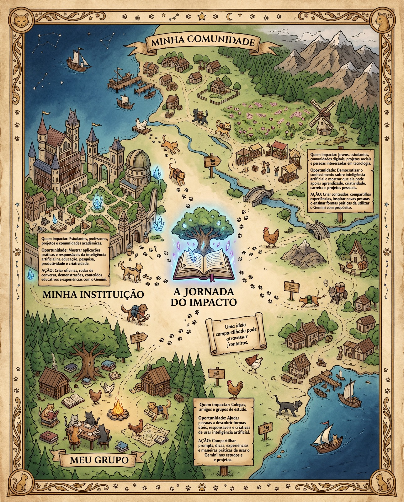
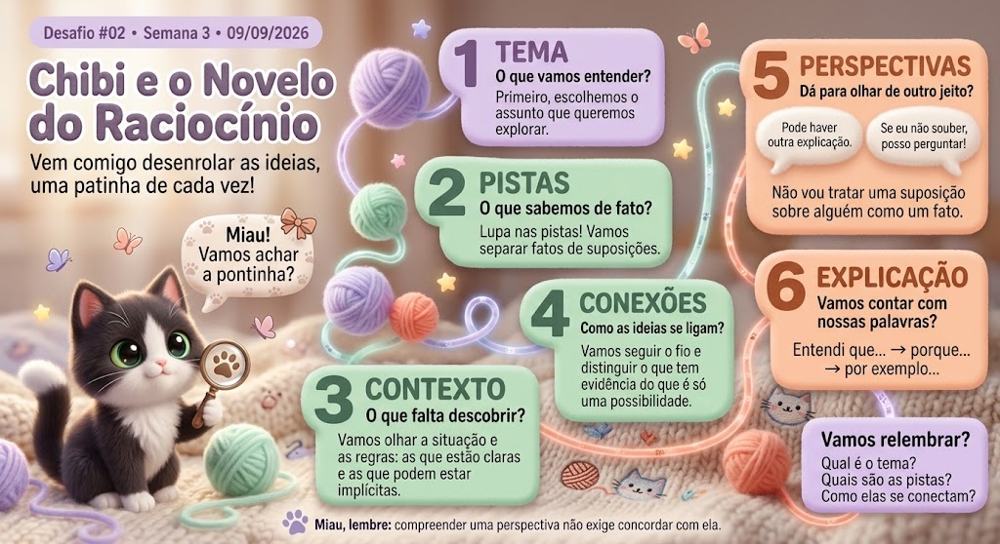

<div align="center">

# 🐱✨ Gemini em Missão

### Minha jornada como Embaixadora Estudantil do Google 2026

**Inteligência Artificial • Aprendizado • Impacto • Criação • Comunidade • Evolução**

<br>

🐈‍⬛ **Miau na área!**

*Entre IA, tecnologia, criatividade e alguns novelos de lã,*  
*Batman acabou assumindo o cargo de porta-voz não oficial desta jornada.* 😼🚀

**🐾 Batman — Supervisor de Projetos • Fiscal de Reuniões • Especialista em Teclados**

<br>

> Um diário de bordo sobre o que me foi proposto, o que eu fiz,  
> o que criei com Inteligência Artificial e como evoluí ao longo da jornada.

<br>

[](https://github.com/SouBeatrizKaroline)
[](https://www.linkedin.com/in/beatrizkcs/)
[](https://soubeatrizkaroline.goskip.app/)

<br>

`🤖 Gemini` `🎓 Educação` `💻 Tecnologia` `🎨 Criatividade`  
`🌎 Impacto` `🧠 Aprendizado` `🐱 Gatinhos`

</div>

---

# 🌟 Sobre o Gemini em Missão

O **Gemini em Missão** é o meu diário público de evolução durante minha jornada como **Embaixadora Estudantil do Google 2026**.

A ideia deste repositório não é apenas marcar atividades como concluídas.

Quero registrar o caminho:

- 🎯 o que foi proposto;
- 📋 como a atividade funcionava;
- 💭 como interpretei o desafio;
- 🚀 o que fiz;
- 💬 o que respondi ou compartilhei;
- 🤖 como utilizei o Gemini;
- ✨ o que criei;
- 🌐 o que transformei em conteúdo ou projeto público;
- 🧠 o que aprendi;
- 🔄 como meu raciocínio evoluiu.

Algumas atividades tiveram **mais de uma resposta, criação ou desdobramento**. Quando isso aconteceu, mantive as diferentes partes porque elas ajudam a mostrar o processo — e não apenas o resultado final.

> 🐾 **A proposta é simples:** documentar a jornada como ela aconteceu, com espaço para experimentar, aprender, criar, errar, melhorar e tentar novamente.

---

# 🔐 Sobre privacidade

Este é um repositório **público**.

Por isso, informações internas da comunidade, dados pessoais de outros participantes, contatos, formulários, códigos individuais e materiais de circulação restrita não são reproduzidos aqui.

Quando uma atividade aconteceu dentro de um espaço privado, registro apenas aquilo que faz sentido para contar minha própria experiência:

> **o que precisava ser feito → o que eu fiz → o que aprendi → no que aquilo se transformou**

---

<a id="sumario"></a>

# ⚡ Explore a Jornada

<details open>
<summary><strong>🌱 Onboarding — Começando a missão</strong></summary>

- [🌐 Entrada na comunidade](#onboarding-entrada)
- [🤝 Conexões e networking](#onboarding-networking)
- [🐱 Quebra-gelo criativo](#onboarding-quebra-gelo)
- [📢 Compartilhando a conquista](#onboarding-conquista)
- [🚀 Encontro de lançamento](#onboarding-lancamento)

</details>

<details>
<summary><strong>🤖 Semana 1 — Meu jeito de trabalhar com IA</strong></summary>

- [🛠️ Preparação](#semana1-preparacao)
- [🐱🎨 Chibi — Identidade do Team 03](#semana1-chibi)
- [🧠 Desafio #01 — Auditoria de Prompt](#semana1-auditoria-prompt)
- [💎 Explorando recursos avançados](#semana1-recursos-avancados)
- [📚 Sessão Gemini #01 — Study Notebooks](#semana1-study-notebooks)
- [🏁 Retrospectiva](#semana1-retrospectiva)

</details>

<details>
<summary><strong>🌎 Semana 2 — Onde a IA pode expandir possibilidades?</strong></summary>

- [🗺️ Desafio #01 — Meu Mapa de Impacto](#semana2-mapa-impacto)
- [🕵️ Missão Embaixadora em Campo](#semana2-embaixadora-campo)
- [📡 Radar de Oportunidades](#semana2-radar-oportunidades)
- [💻 Sessão Gemini #02 — Canvas + Bases de Dados](#semana2-canvas-bases)
- [🎙️ Ação de Impacto — Do Campo ao Conteúdo](#semana2-campo-conteudo)
- [🏁 Retrospectiva](#semana2-retrospectiva)

</details>

<details>
<summary><strong>🧠 Semana 3 — Aprendizagem visual e interativa</strong></summary>

- [💬 Desafio #01 — Onde está o seu desafio?](#semana3-onde-desafio)
- [🎨 Desafio #02 — Transforme seu desafio](#semana3-transforme-desafio)
- [🧩 Sessão Gemini #03 — Gemini Canvas no dia a dia](#semana3-visualizacoes)
- [🎬 Ação de Impacto — Minha Semana em Vídeo com Gemini Omni](#semana3-video-omni)

</details>

<details>
<summary><strong>✨ Extras da jornada</strong></summary>

- [🤖 Projetos que utilizam Gemini](#projetos-gemini)
- [💬 Como meus prompts evoluíram](#evolucao-prompts)
- [📈 Minha evolução](#minha-evolucao)
- [🏆 Marcos da jornada](#marcos)

</details>

---

<a id="linha-do-tempo"></a>

# 🗺️ Linha do Tempo

| Data | Etapa | Missão | Status |
|---|---|---|:---:|
| 14/08/2026 | 🌱 Onboarding | Entrada na comunidade | ✅ |
| 15/08/2026 | 🌱 Onboarding | Conexões e networking | ✅ |
| 16/08/2026 | 🌱 Onboarding | Quebra-gelo criativo | ✅ |
| 16–18/08/2026 | 🌱 Onboarding | Compartilhando a conquista | ✅ |
| 21/08/2026 | 🌱 Onboarding | Encontro de lançamento | ✅ |
| 24–31/08/2026 | 🤖 Semana 1 | Meu jeito de trabalhar com IA | ✅ |
| 25/08/2026 | 🤖 Semana 1 | Auditoria de Prompt | ✅ |
| 28/08/2026 | 🤖 Semana 1 | Study Notebooks | ✅ |
| 01/09/2026 | 🌎 Semana 2 | Meu Mapa de Impacto | ✅ |
| 02–03/09/2026 | 🌎 Semana 2 | Embaixadora em Campo | ✅ |
| 03/09/2026 | 🌎 Semana 2 | Radar de Oportunidades | ✅ |
| 04/09/2026 | 🌎 Semana 2 | Canvas + Bases de Dados | ✅ |
| 04/09/2026 | 🌎 Semana 2 | Do Campo ao Conteúdo | ✅ |
| 08/09/2026 | 🧠 Semana 3 | Onde está o seu desafio? | ✅ |
| 09/09/2026 | 🧠 Semana 3 | Transforme seu desafio | ✅ |
| 10/09/2026 | 🧠 Semana 3 | Gemini Canvas no dia a dia | ✅ |
| 11/09/2026 | 🧠 Semana 3 | Minha Semana em Vídeo com Gemini Omni | ✅ |

---

<a id="onboarding"></a>

# 🌱 ONBOARDING

### 📅 14 a 23 de agosto de 2026

<div align="center">

**Conhecer → Conectar → Compartilhar → Preparar**

</div>

O começo da jornada foi dedicado à entrada na comunidade, às primeiras conexões e à construção da nossa presença como Embaixadores e Embaixadoras.

---

<a id="onboarding-entrada"></a>

<details>
<summary><strong>🌐 14/08 — Entrada na comunidade</strong></summary>

<br>

### 🎯 O que foi proposto

Entrar na comunidade oficial e conhecer sua dinâmica.

O espaço seria utilizado principalmente para:

- trocar conhecimentos;
- conversar sobre estudos e carreira;
- compartilhar experiências com Gemini;
- aprender engenharia de prompts;
- acompanhar desafios;
- colaborar com outros estudantes;
- desenvolver liderança;
- levar o conhecimento para além do grupo.

### 🚀 O que eu fiz

Comecei acompanhando as conversas e conhecendo participantes de diferentes áreas.

A partir dali, passei a compartilhar um pouco da minha trajetória e das minhas experiências com tecnologia, projetos, comunidades e hackathons.

### 🧠 Primeira percepção

> Logo nos primeiros dias, percebi que essa jornada não seria apenas sobre aprender a utilizar o Gemini ou explorar novas ferramentas de IA. A comunidade também fazia parte da experiência.
>
> Encontrar estudantes de diferentes cursos, regiões, experiências e interesses me fez enxergar o programa como um espaço para **trocar conhecimento, criar conexões e transformar interesses em possíveis colaborações**.
>
> Minha primeira reação foi justamente tentar conhecer melhor as pessoas: entender o que cada uma estudava, o que sabia compartilhar, o que queria aprender e quais interesses poderiam aproximá-las.
>
> Foi daí que surgiu uma das minhas primeiras iniciativas espontâneas dentro da comunidade — e também um dos primeiros aprendizados da jornada:
>
> **tecnologia conecta ferramentas, mas são as pessoas, seus contextos e suas necessidades que dão sentido ao que construímos.**

<br>

[⬆️ Voltar ao sumário](#sumario)

</details>

---

<a id="onboarding-networking"></a>

<details>
<summary><strong>🤝 15/08 — Conexões e networking</strong></summary>

<br>

### 🎯 O contexto

Com a abertura da comunidade para interação, começamos a conhecer estudantes de diferentes cursos, áreas e regiões.

As conversas passaram rapidamente por:

`💻 Desenvolvimento` `🎮 Jogos` `🏆 Hackathons`  
`🎨 Criatividade` `📚 Estudos` `🌎 Idiomas`  
`🚀 Carreira` `🤝 Comunidades`

### 💬 Algumas coisas que compartilhei

Falei sobre minha relação com tecnologia e hackathons e sobre como gosto de experiências multidisciplinares.

Uma das ideias que compartilhei foi:

> **“A dica é: não se apegue à solução e sim ao problema.”**
>
> Isso ajuda a pensar em soluções melhores e mais definidas.

Também contei que já havia participado de hackathons nacionais e internacionais e que, no início, utilizava as ferramentas que tinha disponíveis para conseguir participar.

---

### 🌐 Iniciativa espontânea — Networking entre participantes

Durante as conversas, percebi que várias pessoas tinham interesse em:

- encontrar colegas da mesma área;
- descobrir quem poderia ensinar determinado assunto;
- encontrar pessoas interessadas em aprender algo;
- compartilhar projetos;
- trocar redes sociais;
- criar novas conexões.

Então surgiu a ideia de facilitar esse networking.

### 🚀 O que eu fiz

Criei uma iniciativa **não oficial e voluntária** para organizar contatos e interesses.

Cada pessoa poderia escolher se gostaria de compartilhar:

- 🎓 área de estudo ou atuação;
- 💡 conhecimentos que poderia ensinar;
- 🌱 assuntos que gostaria de aprender;
- 🎮 interesses;
- 🌐 redes e comunidades;
- 💬 observações e ideias.

<details>
<summary><strong>💬 Abrir o texto que enviei</strong></summary>

> Fala, pessoal! 👋✨
>
> Agora que o grupo foi reaberto, estou compartilhando uma planilha para quem quiser conhecer melhor os colegas, trocar redes sociais, divulgar projetos e fortalecer nosso networking.
>
> Além das redes sociais, vocês podem compartilhar:
>
> 🎓 Área de estudo ou atuação  
> 💡 Conhecimentos que podem ensinar ou compartilhar  
> 🌱 Assuntos que gostariam de aprender  
> 🎮 Nick de jogos  
> 🌐 Outras redes e comunidades  
> 💬 Observações, ideias e interesses
>
> A ideia é facilitar conexões entre pessoas que possam aprender, ensinar, criar projetos e se ajudar durante o programa.
>
> Preencham apenas os campos que fizerem sentido — não é necessário completar tudo.
>
> ⚠️ Esta é uma iniciativa **não oficial**, criada informalmente entre participantes.
>
> 🔒 O preenchimento é totalmente voluntário. Compartilhe somente dados, perfis e informações com os quais você se sentir confortável.
>
> Vamos aproveitar esse espaço com responsabilidade, respeito e cuidado para construir conexões incríveis e ajudar uns aos outros! 💙🚀

</details>

### 🧠 O que aprendi

Essa experiência me ensinou que **facilitar conexões entre pessoas também exige pensar em segurança, privacidade e contexto**.

A intenção inicial era simples: tornar mais fácil descobrir pessoas com interesses, conhecimentos e objetivos em comum.

Mas fui percebendo que networking também envolve perguntas importantes:

- quais informações realmente precisam ser compartilhadas?
- quem precisa ter acesso?
- por quanto tempo?
- como deixar claro que participar é opcional?
- como evitar exposição desnecessária?
- como equilibrar descoberta, colaboração e segurança?

> **Não basta perguntar “isso conecta pessoas?” — também é preciso perguntar “isso conecta de forma segura, consciente e responsável?”**

### 📈 Como eu faria hoje

Hoje eu começaria pelo desenho da experiência e pela privacidade antes de pensar na ferramenta.

Exploraria alternativas como:

- perfis com informações mínimas e opcionais;
- interesses representados por tags;
- busca por temas ou habilidades;
- conexões mediadas por interesse mútuo;
- acesso restrito;
- possibilidade simples de editar ou remover dados.

A principal mudança seria pensar em **privacy by design** desde o início.

<br>

[⬆️ Voltar ao sumário](#sumario)

</details>

---

<a id="onboarding-quebra-gelo"></a>

<details>
<summary><strong>🐱 16/08 — Quebra-gelo criativo</strong></summary>

<br>

### 🎯 O que foi proposto

Criar uma apresentação pessoal criativa utilizando o **Google Gemini**.

A atividade tinha três partes:

#### 1️⃣ Criar uma imagem

A imagem deveria representar aspectos como:

- personalidade;
- trajetória;
- interesses;
- propósito.

Como o espaço não permitia fotos pessoais, era possível explorar:

- avatares;
- ilustrações;
- personagens;
- representações simbólicas.

#### 2️⃣ Compartilhar a criação

Salvar a imagem gerada e apresentá-la ao grupo.

#### 3️⃣ Se apresentar

A apresentação deveria incluir:

1. nome;
2. curso e universidade;
3. breve resumo do motivo para participar da jornada.

---

### 🚀 O que eu fiz

Em vez de criar apenas uma apresentação tradicional, fiz **duas respostas complementares**.

Na primeira, transformei meu gato **Batman** no narrador.

Na segunda, fiz uma apresentação direta.

---

### 🐈‍⬛ Resposta #01 — Batman apresenta Beatriz

<details>
<summary><strong>🐾 Abrir apresentação completa</strong></summary>

> 🐾 **Miau, Embaixadores! Permitam-me fazer as apresentações…**
>
> Meu nome é **Batman**. 🐈‍⬛🤍  
> Tenho **6 anos**, sou um respeitável gato frajola, supervisor oficial de projetos, fiscal de reuniões, especialista em deitar em cima do teclado e, aparentemente, fui promovido a porta-voz da minha humana.
>
> Sim, porque hoje quem vai apresentar a **Beatriz Karoline** sou eu. 😼
>
> E já aviso: **não tentem entender a trajetória dela olhando apenas para os nomes dos cursos.** Eu tentei. Depois percebi que existe método no caos. 😂
>
> Minha humana é **formada em Enfermagem pela UFPE**, fez **Edificações pelo SENAI**, passou por algumas disciplinas do **Técnico em Mecânica** e também é **Tecnóloga em Análise e Desenvolvimento de Sistemas pela UNINASSAU**.
>
> E ela decidiu que isso ainda era pouco.
>
> Na época dessa apresentação, também estava explorando outras formações e áreas de conhecimento. 🗺️💻📐📊
>
> Agora vocês podem estar pensando:
>
> **“Batman… mas o que Enfermagem, Edificações, Mecânica, Programação, Cartografia e Marketing têm a ver uma coisa com a outra?”**
>
> 😼 Excelente pergunta, humanos.
>
> À primeira vista, parece que ela simplesmente abriu o catálogo de cursos e pensou: *“sim”*. 😂
>
> Mas é justamente aí que está uma das coisas mais legais sobre ela: **Beatriz consegue juntar formações que, olhando de fora, parecem não fazer sentido juntas, e fazer com que elas conversem.**
>
> A Enfermagem ensinou sobre **pessoas, cuidado, saúde e resolução de problemas reais**.
>
> Edificações e a passagem pela Mecânica trouxeram **estrutura, raciocínio técnico, medidas, processos e a compreensão de como coisas são construídas**.
>
> A tecnologia trouxe a possibilidade de **transformar problemas em sistemas, produtos e soluções digitais**.
>
> Outros estudos trouxeram novas perspectivas sobre **território, dados, localização, comunicação e impacto**.
>
> No fim das contas, não são várias histórias desconectadas.
>
> São **várias ferramentas dentro da mesma caixa**. 🧰✨
>
> Ela gosta justamente de encontrar as conexões que ninguém percebe de imediato.
>
> E talvez seja por isso que vocês vão encontrá-la em lugares como **hackathons, game jams, projetos, desafios de inovação e comunidades de tecnologia**. 🚀🎮
>
> Ela adora receber um problema e pensar:
>
> 🧐 *“Tá… mas e se juntarmos tecnologia + saúde + dados + criatividade + experiência do usuário + uma ideia completamente inesperada?”*
>
> E cinco minutos depois provavelmente já existe um protótipo. 😂
>
> Para ela, comunidade não é só estar em um grupo.
>
> É **trocar conhecimento, criar oportunidades, ensinar, aprender, conhecer perspectivas diferentes e crescer junto com outras pessoas**.
>
> 🎮 Ela também ama **games e gamificação**.
>
> Participar de **game jams** combina muito com ela porque junta várias coisas que gosta: programação, narrativa, design, estratégia, criatividade, colaboração e aquela clássica experiência de:
>
> **“Temos pouquíssimo tempo. Vamos criar alguma coisa!”**
>
> O mesmo vale para hackathons.
>
> Talvez seja nesse tipo de ambiente que a multidisciplinaridade dela faça mais sentido.
>
> Enquanto alguém vê um problema de saúde, alguém vê software, alguém vê negócios e alguém vê experiência do usuário…
>
> Beatriz costuma olhar e pensar:
>
> **“Por que não olhar para tudo isso junto?”**
>
> 🌎 E é exatamente essa mentalidade que ela traz para o **Programa Embaixadores Estudantis Google 2026**.
>
> Ela está aqui porque quer **aprender, compartilhar, experimentar, construir projetos, fortalecer comunidades, conhecer pessoas com histórias completamente diferentes e transformar conhecimento em coisas que tenham impacto real**.
>
> Agora sobre a imagem que vocês estão vendo… 👀
>
> Sim.
>
> **Sou eu.** 😼✨
>
> Os fios, circuitos, games, conexões, saúde, constelações e caminhos representam um pouco desse universo.
>
> E os novelos fazem bastante sentido, obviamente.
>
> Finalmente alguma representação acadêmica séria reconhecendo a importância dos gatos na evolução da humanidade. 🧶🐾
>
> Cada caminho parece diferente, mas todos acabam se conectando.
>
> Assim como as formações dela.
>
> Assim como os projetos.
>
> Assim como as comunidades.
>
> Assim como as ideias.
>
> E eu, Batman, sou o companheiro dela em todas essas vidas. 🐈‍⬛💚
>
> Observador, curioso, independente, um pouquinho teimoso e sempre analisando tudo de longe.
>
> Qualquer semelhança entre nós dois certamente não é coincidência. 😼
>
> 🚀 **Habitat natural:** hackathons, game jams, comunidades, projetos e ideias demais abertas ao mesmo tempo.
>
> Agora eu tenho uma missão para vocês. 😼👇
>
> **Qual é aquela coisa da trajetória de vocês que, olhando de fora, parece não combinar com o resto… mas que hoje faz todo sentido?**
>
> Porque às vezes os caminhos mais interessantes são justamente aqueles que parecem não combinar no começo. ✨
>
> Prazer em conhecer vocês, Embaixadores! 💜🚀
>
> Agora vou devolver o celular para minha humana.
>
> Tenho assuntos mais urgentes para resolver.
>
> Existe um novelo desacompanhado por aqui. 🧶🐈‍⬛

</details>

---

### 👩‍💻 Resposta #02 — Minha apresentação direta

<details>
<summary><strong>💬 Abrir segunda apresentação</strong></summary>

> Oi, pessoal! 💜🚀
>
> O Batman já fez as honras e me apresentou do jeitinho dele antes 😹, mas agora chegou oficialmente a minha vez!
>
> 1️⃣ Eu sou **Beatriz Karoline**.
>
> 2️⃣ Minha trajetória passa por diferentes áreas que, à primeira vista, parecem distantes, mas que aprendi a conectar em tudo o que faço. ✨
>
> 3️⃣ Estou aqui porque acredito muito no poder de **conectar pessoas, conhecimentos e ideias diferentes para criar coisas que realmente façam sentido**.
>
> Amo hackathons, game jams, comunidades, tecnologia, inovação e aqueles desafios em que precisamos entender um problema, criar algo novo e fazer uma ideia ganhar vida. 🚀
>
> Quero aproveitar o Programa de Embaixadores para **aprender, compartilhar, conhecer novas perspectivas, fortalecer comunidades e transformar toda essa troca em projetos e oportunidades reais**.
>
> E, pelo que vocês provavelmente já conheceram… o frajolinha da imagem é o Batman, meu companheiro e participante não oficial de praticamente tudo que eu faço. 🐈‍⬛🤍😹

</details>

---

### 🎨 Resultado

<div align="center">


</div>

| Elemento | O que representa |
|---|---|
| 🐈‍⬛ Batman | Identidade criativa e companheiro da jornada |
| 💻 Código | Desenvolvimento e tecnologia |
| 🔌 Circuitos | Sistemas, IA e inovação |
| 🧠 Redes | Conhecimento e conexões |
| ❤️ Saúde | Minha trajetória em Enfermagem |
| 🎮 Games | Jogos, game jams e criatividade |
| 🧶 Novelos | Batman e a identidade felina |
| 🌉 Cidade | Território e diferentes caminhos |
| ✨ Constelações | Conexões entre áreas aparentemente distantes |
| ♾️ Fluxos | Aprendizado contínuo |

<br>

[⬆️ Voltar ao sumário](#sumario)

</details>

---

<a id="onboarding-conquista"></a>

<details>
<summary><strong>📢 16–18/08 — Compartilhando a conquista</strong></summary>

<br>

### 🎯 O que foi proposto

Contar publicamente que passei a fazer parte do **Programa de Embaixadores Estudantis do Google**, transformando a conquista em um registro da minha jornada.

A atividade sugeria:

1. preparar o material;
2. compartilhar em uma rede social;
3. explicar o que a conquista representava;
4. falar sobre o propósito da participação;
5. utilizar `#EmbaixadoresEstudantisGoogle`.

### 🚀 O que eu fiz

Transformei esse momento em uma publicação no **LinkedIn**, compartilhando publicamente minha entrada no programa.

Além de celebrar a conquista, a publicação se tornou um dos primeiros registros públicos da jornada.

<div align="center">

### 💼 Publicação no LinkedIn

[**🌐 Abrir publicação**](https://www.linkedin.com/posts/beatrizkcs_embaixadoresestudantisgoogle-embaixadoresestudantisgooglegemini-activity-7494394307228049408-2Iqe?utm_source=share&utm_medium=member_desktop&rcm=ACoAACr1MqMByBIAjO5wlUJa0E77dw2bL0lnWOQ)

</div>

### 🧠 O que aprendi

Compartilhar uma conquista pode ir além de simplesmente anunciar que algo aconteceu.

Também pode ser uma maneira de:

- 📝 registrar um marco;
- 🎯 explicar o propósito;
- 🤝 encontrar pessoas com interesses semelhantes;
- 🌐 ampliar conexões;
- 💼 construir um portfólio público;
- 🚀 criar continuidade para projetos futuros.

> **Não quero mostrar apenas resultados finais. Quero registrar processo, experimentação, aprendizado e evolução.**

<br>

[⬆️ Voltar ao sumário](#sumario)

</details>

---

<a id="onboarding-lancamento"></a>

<details>
<summary><strong>🚀 21/08 — Encontro de lançamento</strong></summary>

<br>

### 🎯 O que foi proposto

Participar do encontro que marcou oficialmente o início da jornada como **Embaixadora Estudantil do Google**.

Entre os temas apresentados estavam:

- 💼 carreira;
- 📢 criação de conteúdo;
- ⚡ produtividade;
- 💻 IA e desenvolvimento;
- 📚 pesquisa e estudos;
- 🤖 ecossistema Gemini;
- 🏅 portfólio e certificações;
- 🌎 networking;
- 🤝 liderança e comunidade.

### 🚀 O que eu fiz

Participei do encontro e comecei a organizar como queria viver e documentar a experiência.

Decidi utilizar o programa para:

- experimentar diferentes formas de utilizar IA;
- registrar prompts e aprendizados;
- transformar experiências em conteúdo;
- compartilhar conhecimento;
- fortalecer meu portfólio;
- criar conexões;
- observar minha própria evolução.

Foi nesse momento que este repositório começou a ganhar uma função maior:

> **não apenas guardar entregas, mas documentar o caminho até elas.**

### 💡 O que ficou comigo

<div align="center">

`testar` → `errar` → `ajustar` → `entender` → `aplicar` → `compartilhar`

</div>

A jornada começava a se mostrar como uma combinação de:

<div align="center">

**IA + aprendizado + comunidade + experimentação + impacto**

</div>

<br>

[⬆️ Voltar ao sumário](#sumario)

</details>

---

<a id="semana-1"></a>

# 🤖 SEMANA 1 — Meu jeito de trabalhar com IA

### 📅 24 a 31 de agosto de 2026

<div align="center">

**Preparar → Aprender → Experimentar → Compartilhar → Aprofundar**

</div>

O primeiro ciclo oficial teve como foco observar **como cada pessoa já trabalhava com IA** e experimentar formas melhores de estudar, pesquisar e criar utilizando Gemini.

---

<a id="semana1-preparacao"></a>

<details>
<summary><strong>🛠️ 24/08 — Preparação para a Semana 1</strong></summary>

<br>

### 🎯 O que precisava ser feito

Antes das primeiras missões práticas, a orientação era preparar o ambiente para a semana:

- revisar informações importantes;
- organizar o ambiente;
- garantir acesso aos recursos;
- acompanhar o calendário;
- preparar-se para os desafios;
- preparar-se para a primeira Sessão Gemini.

### 🚀 O que eu fiz

- [x] acompanhei as orientações e o calendário;
- [x] organizei os próximos passos;
- [x] comecei a estruturar como registraria meus aprendizados;
- [x] participei das interações do **Team 03**;
- [x] contribuí para a identidade visual do mascote;
- [x] criei diferentes figurinhas do **Chibi**.

<br>

[⬆️ Voltar ao sumário](#sumario)

</details>

---

<a id="semana1-chibi"></a>

<details>
<summary><strong>🐱🎨 Chibi — Construindo a identidade do Team 03</strong></summary>

<br>

Durante a preparação da primeira semana, o **Team 03** escolheu um mascote para representar o grupo.

<div align="center">

## 🐱🎉 CHIBI! 🎉🐱

**Mascote eleito pelo Team 03**

</div>

### 🗳️ O anúncio

> 🗳️ **ATENÇÃO, ATENÇÃO! SAIU O RESULTADO DAS URNAS!** 🚨🐾
>
> Após uma votação histórica, com intensa campanha de fofura e propostas irresistíveis, o TEAM 03 anuncia o seu mascote eleito:
>
> 🐱🎉 **CHIBI!** 🎉🐱
>
> Com uma plataforma baseada em curiosidade, colaboração, criatividade e inovação, Chibi conquistou os votos e, principalmente, os corações do nosso time! 💙
>
> **Suas principais propostas de campanha:**
>
> ✅ Mais conhecimento compartilhado.  
> ✅ Mais conexão entre estudantes.  
> ✅ Mais criatividade e inovação.  
> ✅ Mais inteligência artificial para transformar realidades.  
> ✅ E, claro, muito mais fofura nessa jornada! 🐾
>
> **CHIBI ELEITO! A escolha do TEAM 03!** 💙❤️💛💚

### 🎨 Minha contribuição

A ideia inicial do mascote surgiu a partir de outro integrante do grupo.

Minha contribuição veio depois:

> **transformar o Chibi em uma identidade visual que pudesse realmente ser utilizada pelo Team 03.**

Criei diferentes versões e figurinhas para que o personagem pudesse aparecer nas conversas e interações da comunidade.

<div align="center">


<br><br>

**🐱 Chibi — Mascote do Team 03**  
*Curiosidade • Colaboração • Criatividade • Inovação*

<br><br>


</div>

### 🧠 O que aprendi

Um mascote, uma figurinha ou uma brincadeira interna podem ajudar a criar **identidade, pertencimento e uma linguagem compartilhada**.

Também foi uma experiência sobre colaboração:

> **Nem toda contribuição precisa começar com a ideia original. Às vezes, colaborar significa pegar uma boa ideia coletiva e usar aquilo que você sabe fazer para ajudá-la a ganhar forma.**

<br>

[⬆️ Voltar ao sumário](#sumario)

</details>

---

<a id="semana1-auditoria-prompt"></a>

<details>
<summary><strong>🧠 25/08 — Desafio #01: Auditoria de Prompt</strong></summary>

<br>

### 🎯 O que foi proposto

Todas as pessoas receberam o mesmo prompt:

> **“Tenho uma prova na sexta-feira. Monte um plano de estudos para mim.”**

A missão era assumir o papel de **Auditor(a) de Prompts** e responder:

> **Se esse prompt fosse seu, o que você mudaria para receber uma resposta muito melhor?**

Era possível:

- acrescentar contexto;
- informar conteúdos;
- adicionar referências;
- explicar disponibilidade;
- criar restrições;
- mudar a estrutura;
- fazer perguntas;
- adicionar estratégias;
- reconstruir o prompt.

---

### 🚀 O que eu fiz

Minha primeira percepção foi que **não existe necessariamente um prompt perfeito isolado do contexto**.

A resposta dependeria das informações disponíveis sobre a prova, minha rotina, minhas preferências e os materiais.

### 💬 Minha resposta #01

<details>
<summary><strong>Abrir resposta original</strong></summary>

> Acho que dependeria do contexto, e também do quanto eu estivesse conseguindo organizar o que gostaria, quanto mais detalhes do que quero, mais precisa está é, porém para começar de maneira simplificada.
>
> Enviaria o print da minha agenda da semana e da grade curricular e do que mais achasse relevante
>
> Sendo meu professor particular da materia de [especificar] e sabendo que tenho uma prova na sexta-feira desta, onde irá ser sobre [assunto], conforme meu cronograma e disponibilidade e sem afetar meu tempo de sono, sabendo que estamos usando as referências [indicar quais], faça um cronograma de estudo completo para que eu estudei até a quinta antes da prova. Tenho preferência por estudos [especificar metodo, longo ou curto e afins].

</details>

### ✨ Meu prompt aprimorado

```text
Sendo meu professor particular da matéria de [especificar] e sabendo que tenho uma prova na sexta-feira desta, onde irá ser sobre [assunto], conforme meu cronograma e disponibilidade e sem afetar meu tempo de sono, sabendo que estamos usando as referências [indicar quais], faça um cronograma de estudo completo para que eu estude até a quinta antes da prova.

Tenho preferência por estudos [especificar método, longo ou curto e afins].
```

Também sugeri fornecer:

- 📅 agenda;
- 🎓 grade curricular;
- 📚 referências;
- 📝 conteúdo da prova;
- ⏰ disponibilidade;
- 😴 limite para não prejudicar o sono;
- 🧠 preferências de estudo.

Minha lógica saiu de:

<div align="center">

`pedido genérico`

⬇️

`contexto + objetivo + materiais + disponibilidade + restrições + preferências`

</div>

---

### 💡 Minha segunda estratégia

Também sugeri usar a própria IA para ajudar a melhorar o prompt antes de executar a tarefa principal.

> Uma coisa é pedir a própria IA para estruturar e melhorar o prompt antes, principalmente no início, se eu não usasse ela, poderia ajudar, pois cada IA atende melhor por formulações diferentes

<div align="center">

`ideia inicial` → `IA ajuda a estruturar` → `revisão` → `prompt aprimorado` → `execução`

</div>

---

### 🔥 Aprendendo com a comunidade

Na segunda parte do desafio, precisávamos escolher uma estratégia utilizada por outra pessoa que gostaríamos de incorporar.

Escolhi uma contribuição que utilizava **Markdown, formato de saída, restrições e meta-prompting**.

<details>
<summary><strong>💬 Abrir contribuição escolhida</strong></summary>

> 💬 **EU MELHORARIA O PROMPT…**
>
> Primeiro usaria markdowns, pois já ouvi falar que a IA responde melhor a esse estilo de prompt, além de especificar o formato de saída que eu desejo para que a resposta seja algo que eu consiga entender, além de colocar restrições, como por exemplo não buscar informações em certo site. Além de pedir para a própria GenIA, melhorar o prompt para mim.
>
> **PROMPT:**

```text
Atue como um tutor acadêmico e monte um plano de estudos intensivo para uma prova que farei nesta sexta-feira.

Contexto
Matéria / Tópicos: [Insira a matéria e os tópicos principais]
Tempo disponível: [Ex: 2 horas por noite]
Nível de conhecimento atual: [Ex: Básico / Intermediário / Revisão]

Formato de Saída Desejado
Apresente o cronograma organizado por dias (de hoje até quinta-feira).
Use tabelas ou listas em tópicos com destaques em negrito para facilitar a leitura rápida e visual.
Mantenha as explicações diretas, sem linguagem rebuscada ou acadêmica excessiva.

Restrições
Não utilize fontes ou conteúdos do site [Insira o site que deseja excluir, ex: Wikipedia / site X].
Não sobrecarregue a véspera da prova (quinta-feira); foque apenas em revisão leve e descanso.
Evite introduções longas ou textos teóricos; vá direto ao plano de ação diário.
```

</details>

### 💬 Minha resposta #03

> Eu usaria essa dica, para entender melhor o funcionamento de markdowns na IA, pois não é algo que costumo utilizar tanto e dependendo da IA pode realmente funcionar bem

### 🧠 O que aprendi

O desafio mostrou que melhorar prompts não significa decorar uma fórmula.

> **É desenvolver repertório para decidir quais informações, estruturas e restrições fazem sentido para cada problema.**

Também comecei a explorar mais **Markdown como ferramenta de estruturação**.

### 📈 Como eu faria hoje

Hoje eu adicionaria uma etapa de diagnóstico:

```text
# Papel

Atue como meu professor particular e orientador de estudos para [DISCIPLINA].

# Contexto

Tenho uma prova na sexta-feira sobre:

[CONTEÚDOS]

As principais referências utilizadas são:

[REFERÊNCIAS]

Também fornecerei minha agenda da semana, minha grade curricular e os materiais que considerar relevantes.

# Restrições

- O planejamento deve terminar na quinta-feira.
- Não reduza meu tempo habitual de sono.
- Considere apenas os horários realmente disponíveis na minha agenda.
- Minha preferência de estudo é [MÉTODO/PREFERÊNCIA].
- Priorize os conteúdos em que eu demonstrar maior dificuldade.

# Antes de criar o cronograma

Analise as informações fornecidas e identifique o que ainda está faltando para montar um plano realmente personalizado.

Faça apenas as perguntas necessárias para preencher essas lacunas.

Depois das minhas respostas:

1. identifique os conteúdos prioritários;
2. distribua os estudos de acordo com minha disponibilidade;
3. inclua momentos de revisão e recuperação;
4. indique objetivos concretos para cada bloco;
5. reserve um momento final de revisão antes da prova.

# Formato da resposta

Apresente:

1. um resumo da estratégia;
2. uma tabela com dia, horário, conteúdo, objetivo e método;
3. pontos de atenção;
4. uma checklist final para acompanhar meu progresso.
```

<div align="center">

**Antes**

`dar mais contexto → pedir um cronograma melhor`

**Depois**

`dar contexto → identificar lacunas → perguntar → priorizar → planejar → acompanhar`

</div>

> 🐾 **Um bom prompt não precisa nascer pronto. Ele pode ser construído em diálogo, ganhar contexto, incorporar técnicas de outras pessoas e melhorar conforme entendemos melhor o problema.**

<br>

[⬆️ Voltar ao sumário](#sumario)

</details>

---

<a id="semana1-recursos-avancados"></a>

<details>
<summary><strong>💎 26/08 — Explorando recursos avançados</strong></summary>

<br>

### 🎯 O que foi explorado

A etapa apresentou possibilidades ampliadas do ecossistema Gemini para:

- tarefas complexas;
- pesquisa aprofundada;
- estudos;
- documentos;
- produtividade;
- criação;
- experimentos;
- prototipagem.

Foi uma etapa de exploração que ampliou o repertório para as missões seguintes da jornada.

<br>

[⬆️ Voltar ao sumário](#sumario)

</details>

---

<a id="semana1-study-notebooks"></a>

<details>
<summary><strong>📚 28/08 — Sessão Gemini #01: Study Notebooks</strong></summary>

<br>

### 🎯 O que foi explorado

A sessão mostrou formas de transformar:

- fontes;
- artigos;
- materiais de estudo;
- referências;
- conteúdos acadêmicos;

em um **espaço estruturado de conhecimento**.

Entre as possibilidades estavam:

- pesquisar;
- organizar informações;
- estudar;
- aprofundar conteúdos;
- trabalhar com fontes;
- construir uma experiência de aprendizagem mais estruturada.

### 🧠 O que ficou da sessão

A experiência começou a ampliar meu olhar sobre IA para além de perguntas isoladas.

Em vez de apenas:

`perguntar → responder`

o conhecimento também poderia ser:

`reunido → organizado → explorado → conectado → aprofundado`

<br>

[⬆️ Voltar ao sumário](#sumario)

</details>

---

<a id="semana1-retrospectiva"></a>

<details>
<summary><strong>🏁 Retrospectiva — Semana 1</strong></summary>

<br>

### 🌱 Antes

Eu já utilizava IA em diferentes tarefas, mas muitas vezes começava diretamente pela pergunta ou pelo resultado.

### 🚀 Depois

Passei a prestar mais atenção em:

- contexto;
- objetivo;
- materiais disponíveis;
- restrições;
- preferências;
- estrutura;
- perguntas que ainda precisam ser respondidas.

Também comecei a observar como outras pessoas estruturavam suas solicitações.

### ⭐ Maior aprendizado

> **Um bom prompt não precisa nascer pronto. Ele pode ser construído, testado, comparado e refinado conforme entendemos melhor o problema.**

<br>

[⬆️ Voltar ao sumário](#sumario)

</details>

---

<a id="semana-2"></a>

# 🌎 SEMANA 2 — Onde a IA pode expandir possibilidades?

### 📅 31 de agosto a 04 de setembro de 2026

Na segunda semana, o foco mudou.

<div align="center">

`PESSOAS`

⬇️

`CONTEXTO`

⬇️

`NECESSIDADES`

⬇️

`OPORTUNIDADES`

⬇️

`IA`

</div>

A pergunta principal era:

> **Onde existem situações reais em que o Gemini pode ampliar possibilidades?**

---

<a id="semana2-mapa-impacto"></a>

<details>
<summary><strong>🗺️ 01/09 — Desafio #01: Meu Mapa de Impacto</strong></summary>

<br>

### 🎯 O que foi proposto

Criar com o **Google Gemini** uma representação visual do meu próprio **Mapa de Impacto** como Embaixadora Estudantil.

O mapa deveria explorar:

<div align="center">

`MEU GRUPO` → `MINHA INSTITUIÇÃO` → `MINHA COMUNIDADE`

</div>

A reflexão considerava:

- quem eu poderia impactar;
- qual necessidade ou oportunidade existia;
- qual ação concreta poderia realizar;
- como Gemini ou IA poderiam apoiar.

---

### 🚀 O que eu fiz

Transformei os três níveis em um **mapa de aventura inspirado em RPG e literatura fantástica**, com gatinhos, cachorrinhos e galinhas pelo caminho. 🐱🐶🐔📚

> **E por que galinhas? Porque elas são nossas amigas. @-@**

### 🌲 Meu Grupo

Compartilhar:

- prompts;
- experiências;
- formas práticas de usar Gemini;
- aplicações em projetos;
- maneiras de organizar ideias.

### 🏰 Minha Instituição

Ampliar esse conhecimento para:

- estudantes;
- professores;
- projetos acadêmicos;
- pessoas de diferentes áreas.

### 🌎 Minha Comunidade

Levar as descobertas para:

- outros estudantes;
- jovens;
- comunidades digitais;
- projetos sociais;
- novas pessoas e iniciativas.

---

### 💬 Minha entrega

> 🗺️✨ **Meu Mapa de Impacto**
>
> Para representar minha jornada como Embaixadora Estudantil Google Gemini, transformei os três níveis de impacto em um mapa de aventura inspirado em RPG e literatura fantástica, com muitos gatinhos, cachorrinhos e galinhas pelo caminho. 🐱🐶🐔📚
>
> 🌲 **Meu Grupo:** quero começar pelas pessoas mais próximas, compartilhando prompts, experiências e formas práticas de usar o Gemini nos estudos, projetos e na organização de ideias.
>
> 🏰 **Minha Instituição:** quero ampliar esse conhecimento para estudantes, professores e projetos acadêmicos, mostrando aplicações responsáveis da IA em educação, pesquisa, criatividade e produtividade.
>
> 🌎 **Minha Comunidade:** quero levar essas descobertas ainda mais longe, alcançando jovens, comunidades digitais e projetos sociais por meio de conteúdos, experiências e troca de conhecimento.
>
> No centro do mapa está a ideia que mais representa essa jornada para mim:
>
> **“Uma ideia compartilhada pode atravessar fronteiras.”** 💙

<div align="center">



</div>

---

### 🎬 A Jornada do Impacto

Além da imagem, transformei o mapa em um vídeo acompanhado de uma pequena narrativa.

<div align="center">

### ▶️ [Assistir ao vídeo — A Jornada do Impacto](https://github.com/user-attachments/assets/25e5edae-a93f-4704-bafc-ebf85e8558ab)

</div>

<details>
<summary><strong>📖 Abrir a história completa</strong></summary>

> Dizem que todo mapa guarda uma história… e este começa bem perto de mim. 🗺️🐾
>
> No primeiro território, onde está *Meu Grupo*, surgem as primeiras trilhas. É ali, entre conversas, ideias, dúvidas e descobertas compartilhadas, que nasce a vontade de levar conhecimento adiante. Uma pequena faísca, quase como uma luz acesa no meio da floresta. 🐾🌱🛤️
>
> E então o caminho começa a se abrir. 🗺️✨
>
> Guiada pela curiosidade e pela vontade de compartilhar o que descubro, sigo as pegadas para além daquele primeiro território. A trilha atravessa pontes, livros e novos encontros até alcançar finalmente a *Minha Instituição*, onde novos caminhos se abrem e me levam a encontrar novos estudantes, professores, projetos e pessoas com diferentes conhecimentos, histórias e ideias para compartilhar. 💭📖✨
>
> Ali, cada conversa pode abrir uma nova passagem, uma nova estrada. Cada descoberta pode virar uma ponte. E o *Mestre Gemini*, com sua magia feita de tecnologia, pode nos guiar pelas jornadas, ajudando cada viajante a transformar curiosidade em descoberta, ideias em criação e perguntas em novos caminhos para aprender, pesquisar e experimentar. 📚🔬✨
>
> Mas nenhum bom mapa termina nos muros de um reino. 🏰🗺️
>
> Ao longe, outras trilhas, desafios e novos caminhos aparecem. ⛰️🌲
>
> Eles atravessam rios, florestas, montanhas e fronteiras até alcançar, finalmente, a *Minha Comunidade* — ao menos, a primeira delas — onde outros estudantes, jovens, projetos e, quem sabe, parceiros de aventuras que eu ainda nem conheço direito se encontram. 🤝🐾
>
> E quanto mais o mapa se expande, mais percebo que o impacto não segue um único caminho. Ele revela novas regiões e lugares no mapa. 🏞️💫
>
> Uma pessoa aprende algo, compartilha com outra, que leva aquela descoberta para um novo lugar… e, de repente, aquilo que começou em um pequeno grupo já encontrou territórios que eu nem imaginava alcançar. 🐱🐶🐔
>
> E tudo isso gera *A Jornada do Impacto*. 📖✨
>
> Um lembrete de que não é preciso começar conquistando o mapa inteiro. Às vezes, basta compartilhar uma ideia, despertar uma curiosidade e dar o primeiro passo. 🐾
>
> Porque **uma ideia compartilhada pode atravessar fronteiras.** 📖🌎💫
>
> E este mapa? 🗺️✨
>
> Ainda está longe de estar completo. Existem muitos caminhos para descobrir, comunidades para encontrar e novas histórias para escrever. 📚🐾

</details>

### 🧠 O que descobri

> **Impacto não precisa começar grande para poder crescer.**

Uma troca próxima pode se transformar em conteúdo, uma descoberta pode virar ponte e uma ideia pode chegar a contextos que eu não previa inicialmente.

<br>

[⬆️ Voltar ao sumário](#sumario)

</details>

---

<a id="semana2-embaixadora-campo"></a>

<details>
<summary><strong>🕵️ 02–03/09 — Missão Embaixadora em Campo</strong></summary>

<br>

### 🎯 O que foi proposto

Conversar com pelo menos duas pessoas da comunidade acadêmica e observar situações da rotina que mereciam atenção.

O foco era:

<div align="center">

`OUVIR → OBSERVAR → COMPREENDER`

</div>

Algumas perguntas sugeridas eram:

> **O que mais toma seu tempo ou energia na faculdade hoje?**

> **Tem alguma tarefa ou processo que você acha confuso ou repetitivo?**

> **Se pudesse facilitar uma única coisa da sua rotina acadêmica, qual seria?**

### 🚀 O que eu fiz

Em vez de conversar apenas com duas pessoas, ampliei a escuta e enviei uma pergunta aberta para estudantes e pessoas da minha rede.

<details>
<summary><strong>💬 Abrir mensagem original</strong></summary>

> Gente, posso fazer uma perguntinha aleatória sobre a rotina de vocês na faculdade? 👀😂
>
> Tô tentando entender quais são aquelas pequenas coisas da vida acadêmica que mais dão trabalho, tomam tempo ou simplesmente fazem a gente pensar: “isso podia ser muito mais fácil” kkkkk
>
> Pode ser qualquer coisa mesmo: matrícula, organizar horários, acompanhar atividades e prazos, achar informações, estudar, trabalhos em grupo, falar com algum setor, usar os sistemas da faculdade… 🫠
>
> O que mais incomoda vocês hoje?
>
> E se vocês pudessem escolher UMA coisa da faculdade para magicamente ficar mais fácil ou automática, o que escolheriam? ✨
>
> Vale reclamar também 😂 inclusive quero saber das coisas mais bobas, repetitivas ou confusas.

</details>

### 🔎 Padrões que apareceram

As respostas apontaram temas recorrentes:

- informações acadêmicas espalhadas;
- dificuldade para encontrar orientações;
- burocracia;
- comunicação com setores;
- portais pouco intuitivos;
- matrícula e disciplinas;
- prazos;
- horas complementares;
- extensão;
- estágio;
- trabalhos em grupo;
- conciliação entre faculdade e outras responsabilidades.

O principal padrão foi:

> **encontrar, compreender e organizar informações acadêmicas.**

A pergunta começou a mudar de:

> **“Qual processo posso automatizar?”**

para:

> **“Como reduzir o esforço necessário para o estudante encontrar, compreender e organizar aquilo que já existe?”**

<br>

[⬆️ Voltar ao sumário](#sumario)

</details>

---

<a id="semana2-radar-oportunidades"></a>

<details>
<summary><strong>📡 03/09 — Radar de Oportunidades</strong></summary>

<br>

### 🎯 O que foi proposto

Usar as descobertas da investigação em campo para formular uma hipótese de onde o Google Gemini poderia apoiar.

A entrega deveria responder:

- 🔎 o que está acontecendo;
- 👥 quem vive essa situação;
- 💭 onde o Gemini poderia apoiar.

> O objetivo não era construir uma solução pronta, mas formular uma boa hipótese.

---

### 🚀 Minha entrega

#### 🔎 O que está acontecendo

> Conversando com estudantes e pessoas que já passaram pela universidade, percebi que, apesar das experiências serem diferentes, alguns problemas se repetem bastante. O principal deles parece ser a dificuldade de encontrar, entender e organizar informações acadêmicas.
>
> Foram citados problemas como informações espalhadas em diferentes sistemas e grupos, dificuldade para falar com secretarias e coordenações, burocracia para resolver situações simples, portais pouco intuitivos, dúvidas sobre matrícula e disciplinas, além de dificuldades para acompanhar prazos, atividades, horas complementares, extensão, estágio e outras exigências da graduação.
>
> Também apareceram questões de sobrecarga: professores concentrando várias entregas no mesmo período, dificuldade para conciliar faculdade e trabalho e problemas na organização de trabalhos em grupo.

#### 👥 Quem vive essa situação

> Principalmente estudantes de graduação, tanto de instituições públicas quanto privadas e de diferentes períodos.
>
> Alguns desses problemas também continuam sendo lembrados por pessoas que já concluíram a graduação, indicando que não parecem ser situações isoladas de uma única faculdade.

#### 💭 Minha hipótese com o Google Gemini

> Minha hipótese é que o Google Gemini poderia funcionar como uma **camada de apoio entre o estudante e a grande quantidade de informações da vida acadêmica**.
>
> Em vez de tentar substituir os sistemas oficiais da universidade, ele poderia ajudar o aluno a reunir, interpretar e organizar informações que já existem: regulamentos, calendários, editais, horários, oportunidades, atividades de extensão, horas complementares, bolsas, projetos, documentos e prazos.
>
> O Gemini também poderia apoiar o planejamento da rotina acadêmica, ajudando a transformar várias disciplinas, atividades e prazos em um plano mais organizado e compreensível.
>
> A ideia não seria a IA tomar decisões pela universidade ou fornecer informações como se fossem oficiais, mas diminuir o esforço necessário para o estudante localizar, compreender e organizar aquilo que já está disponível.

### 💡 Hipótese central

> **Se o estudante tiver uma forma simples de centralizar, consultar e organizar as informações da própria vida acadêmica com apoio do Google Gemini, parte da burocracia percebida, da desorganização e do tempo gasto procurando informações pode ser reduzida.**

---

### 🤝 Da hipótese ao EntreNós

Essa hipótese acabou evoluindo para um primeiro protótipo chamado **EntreNós**.

A proposta é criar um espaço de apoio coletivo entre estudantes, no qual dúvidas, experiências e informações possam se conectar, com IA apoiando a organização e a síntese.

<div align="center">

### 🤝 [Abrir EntreNós](https://entrenos.goskip.app/)

</div>

<details>
<summary><strong>💬 Abrir mensagem que compartilhei</strong></summary>

> Gente, passando aqui pra agradecer de novo quem respondeu aquelas perguntas sobre o que mais dá trabalho na faculdade 💛
>
> Eu fui juntando as respostas, procurando os pontos em comum e percebi que muita coisa se repete: burocracia, dificuldade pra achar informação, horas complementares, extensão, organização, trabalhos em grupo, sistemas ruins… e principalmente aquela sensação de que muita gente acaba tendo que descobrir tudo do zero.
>
> Com base nisso, comecei a desenvolver um protótipo chamado **EntreNós** 🤝✨
>
> A ideia é criar um espaço de apoio coletivo entre estudantes, onde dúvidas e experiências possam se conectar, com apoio do Google Gemini para organizar informações, resumir relatos e ajudar a transformar tudo isso em próximos passos.
>
> Ainda está bem no começo e em desenvolvimento, mas quis compartilhar porque muitas das ideias surgiram justamente das respostas de vocês 🥹
>
> Se quiserem dar uma olhadinha:
>
> https://entrenos.goskip.app/
>
> Espero que gostem! E se tiverem alguma opinião, crítica ou ideia, vou adorar saber 💛

</details>

### 🧠 O que aprendi

<div align="center">

`OUVIR`

⬇️

`COMPARAR RELATOS`

⬇️

`IDENTIFICAR PADRÕES`

⬇️

`ENTENDER O PROBLEMA`

⬇️

`FORMULAR UMA HIPÓTESE`

⬇️

`SÓ DEPOIS PENSAR EM TECNOLOGIA`

</div>

> **Uma boa oportunidade de uso de IA nem sempre começa com uma ideia de tecnologia. Às vezes, começa simplesmente ouvindo pessoas até que um padrão fique impossível de ignorar.**

<br>

[⬆️ Voltar ao sumário](#sumario)

</details>

---

<a id="semana2-canvas-bases"></a>

<details>
<summary><strong>💻 04/09 — Sessão Gemini #02: Canvas + Bases de Dados</strong></summary>

<br>

### 🎯 O que foi explorado

A sessão apresentou uma introdução ao **Gemini Canvas** e mostrou possibilidades como:

- 📊 dashboards;
- ⚡ aplicações funcionais;
- 🔄 experiências atualizadas;
- 💻 protótipos;
- 🗃️ novas formas de organizar e apresentar informações.

### 🚀 O que eu fiz

Como foi um dos meus primeiros contatos com o Gemini Canvas, usei a sessão principalmente para entender o que mudava em relação ao uso tradicional pelo chat.

<div align="center">

`IDEIA`

⬇️

`INFORMAÇÕES`

⬇️

`ESTRUTURA`

⬇️

`CANVAS`

⬇️

`VISUALIZAÇÃO / PROTÓTIPO`

⬇️

`AJUSTES`

</div>

### 🧠 O que aprendi

O principal aprendizado foi perceber a diferença entre **conversar com a IA** e **construir com a IA**.

Uma primeira geração pode ser apenas o ponto de partida para:

- analisar;
- reorganizar;
- testar;
- comparar;
- ajustar;
- melhorar.

> **O Gemini não precisa terminar na resposta. A resposta também pode ser o começo de algo que ainda vou organizar, testar, transformar e construir.**

<br>

[⬆️ Voltar ao sumário](#sumario)

</details>

---

<a id="semana2-campo-conteudo"></a>

<details>
<summary><strong>🎙️ 04/09 — Ação de Impacto: Do Campo ao Conteúdo</strong></summary>

<br>

### 🎯 O que foi proposto

Transformar o que havia sido observado, investigado e analisado durante a semana em **conteúdo**.

O formato era livre:

- 📹 vídeo;
- 📲 publicação;
- ✍️ reflexão;
- outro formato criativo.

### 🚀 O que eu fiz

Criei um **vídeo com o próprio Google Gemini** e publiquei no TikTok.

O conteúdo partiu diretamente da investigação realizada em **Embaixadora em Campo** e da hipótese construída no **Radar de Oportunidades**.

### 💭 A ideia

A oportunidade de IA não precisava estar em substituir os sistemas universitários.

Gemini poderia funcionar como uma camada de apoio para:

- localizar;
- interpretar;
- organizar;
- resumir;
- planejar;

informações que já existem.

<div align="center">

### 🎵 [Assistir ao vídeo no TikTok](https://vt.tiktok.com/ZSq8K1pdS/)

</div>

### 🧠 O que aprendi

<div align="center">

`PESSOAS → CONTEXTO → PROBLEMA → HIPÓTESE → TECNOLOGIA → CONTEÚDO`

</div>

O conteúdo não começou com:

> **“Sobre o que eu quero postar?”**

Começou com:

> **“O que as pessoas estão vivendo?”**

<br>

[⬆️ Voltar ao sumário](#sumario)

</details>

---

<a id="semana2-retrospectiva"></a>

<details>
<summary><strong>🏁 Retrospectiva — Semana 2</strong></summary>

<br>

### 🤖 Semana 1

> **Como eu trabalho com IA?**

### 🌎 Semana 2

> **Como eu identifico situações reais em que IA pode fazer sentido?**

<div align="center">

`PESSOAS → CONTEXTO → PROBLEMA → PADRÕES → HIPÓTESE → TECNOLOGIA → EXPERIMENTO`

</div>

### 💡 Principal aprendizado

> **Antes de pensar no que a IA consegue fazer, vale entender quem vive o problema, como ele aparece na rotina e qual parte dele realmente precisa de apoio.**

<br>

[⬆️ Voltar ao sumário](#sumario)

</details>

---

<a id="semana-3"></a>

# 🧠 SEMANA 3 — Aprendizagem visual e interativa

### 📅 08 a 11 de setembro de 2026

Nesta semana, a proposta foi explorar como Gemini pode ajudar a compreender conteúdos a partir de **representações visuais e interativas**.

---

<a id="semana3-onde-desafio"></a>

<details>
<summary><strong>💬 08/09 — Desafio #01: Onde está o seu desafio?</strong></summary>

<br>

### 🎯 O que foi proposto

Identificar uma dificuldade **específica de aprendizagem** completando:

> **“Eu tenho dificuldade para entender ______ porque ______.”**

A orientação era evitar uma disciplina inteira e localizar exatamente **onde a compreensão travava**.

### 🚀 O que eu fiz

Percebi que meu desafio não estava necessariamente em uma disciplina específica, mas na maneira como organizo, recupero e estruturo informações para depois explicá-las ou utilizá-las com confiança.

### 💬 Minha resposta #01

> **Eu tenho dificuldade em organizar uma boa linha de raciocínio que eu me sinta mais confiante quando for repassar e relembrar o conteúdo.**

### 💬 Minha resposta #02

> **Eu tenho dificuldade em entender certas lógicas principalmente em questão de estruturação social, por que tenho TEA, então consigo estudar e compreender de modo geral, mas não ter uma visão neurotipica.**

### 🔎 Onde estava o desafio?

<div align="center">

`CONTEÚDO`

⬇️

`ESTUDAR`

⬇️

`COMPREENDER`

⬇️

`ORGANIZAR O RACIOCÍNIO`

⬇️

`CONECTAR`

⬇️

`RELEMBRAR`

⬇️

`EXPLICAR COM CONFIANÇA`

</div>

### 🧠 O que descobri

A dificuldade não estava simplesmente em “aprender”.

Ela aparecia principalmente na construção de uma **representação mental organizada**, especialmente quando eu precisava:

- visualizar relações;
- estabelecer sequência;
- identificar hierarquias;
- conectar causa e efeito;
- recuperar informações;
- transformar o que compreendi em uma explicação clara.

Isso abriu uma hipótese para o desafio seguinte:

> **externalizar a estrutura do raciocínio por meio de representações visuais.**

<br>

[⬆️ Voltar ao sumário](#sumario)

</details>

---

<a id="semana3-transforme-desafio"></a>

<details>
<summary><strong>🎨 09/09 — Desafio #02: Transforme seu desafio</strong></summary>

<br>

### 🎯 O que foi proposto

Utilizar:

> **meu próprio raciocínio + Google Gemini + uma forma de representação visual**

para experimentar uma nova maneira de compreender e explicar o desafio da atividade anterior.

<div align="center">

`👀 OBSERVE → 🧩 SIMPLIFIQUE → ✏️ VISUALIZE → 🔗 CONECTE → ✅ REFINE → 📤 COMPARTILHE`

</div>

---

### 🤖 Onde o Gemini entrava

O Gemini poderia funcionar como apoio para:

- observar o tema por outros ângulos;
- identificar o essencial;
- perceber relações;
- explorar representações;
- comparar possibilidades;
- refinar a explicação.

<details>
<summary><strong>🤖 Abrir prompt-base do desafio</strong></summary>

```text
Quero usar uma forma de representação visual para me ajudar a explorar por outros ângulos um desafio de aprendizagem. O desafio que compartilhei foi: "[COLE SUA FRASE COM O DESAFIO QUE COMPARTILHOU]". Antes de falar com você, minha hipótese é que a principal dificuldade está em visualizar: [INSIRA SUA HIPÓTESE — por exemplo: uma sequência, uma diferença entre conceitos, uma relação de causa e efeito, conexões entre ideias, uma hierarquia ou uma ideia abstrata].

Quero que você seja meu apoio de raciocínio visual. Ainda não gere nenhuma imagem. Vamos seguir com as seguintes etapas:

1. OBSERVE: Analise a dificuldade descrita e identifique quais elementos, conceitos ou informações é necessário compreender para responder especificamente àquilo que eu estou tendo dificuldade para entender.

2. SIMPLIFIQUE: Organize essa informação nas ideias e estruturas essenciais. Separe o central do secundário, conservando tudo o que for necessário para que a explicação continue correta e faça sentido.

3. VISUALIZE: Proponha 3 maneiras diferentes de dar forma visual a essas ideias. Você pode considerar, quando fizer sentido: mapa mental, mapa conceitual, fluxograma, storyboard, analogia visual, sketchnote/anotações visuais, linha do tempo, diagrama, infográfico ou outra técnica adequada.

4. CONECTE: Para cada possibilidade visual, mostre quais relações entre os elementos deveriam ficar claramente representadas.

5. ANALISE MINHA HIPÓTESE: Compare sua análise com a minha hipótese inicial. Diga-me se parece coerente e explique brevemente o porquê.

Ao final, não escolha a representação por mim. Faça-me uma pergunta que me ajude a decidir qual das possibilidades quero testar.
```

</details>

---

### 🚀 O que eu fiz

Decidi transformar meu desafio em uma representação visual mais lúdica usando o **Chibi** e a metáfora de um **novelo do raciocínio**.

Às vezes eu consigo compreender um conteúdo, mas na hora de recuperar, estruturar ou explicar parece que o “fio” se perdeu dentro de um novelo.

Então transformei o processo em uma espécie de **guia visual para desenrolar ideias uma etapa de cada vez**.

### ✅ Representação escolhida

<div align="center">

`1. TEMA`

⬇️

`2. PISTAS`

⬇️

`3. CONTEXTO`

⬇️

`4. CONEXÕES`

⬇️

`5. PERSPECTIVAS`

⬇️

`6. EXPLICAÇÃO`

</div>

#### 1️⃣ Tema — O que vamos entender?

Delimitar exatamente o assunto.

#### 2️⃣ Pistas — O que sabemos de fato?

Separar informações conhecidas de interpretações e suposições.

#### 3️⃣ Contexto — O que falta descobrir?

Observar situação, regras e elementos explícitos ou implícitos.

#### 4️⃣ Conexões — Como as ideias se ligam?

Seguir o “fio” entre os elementos.

#### 5️⃣ Perspectivas — Dá para olhar de outro jeito?

Considerar outras explicações e lembrar que perguntar também faz parte do processo.

#### 6️⃣ Explicação — Vamos contar com nossas palavras?

```text
Entendi que...
      ↓
porque...
      ↓
por exemplo...
```

---

### ✨ Chibi e o Novelo do Raciocínio

<div align="center">



</div>

A metáfora do novelo representa o processo de encontrar a “pontinha” de uma ideia e seguir o fio até que as relações fiquem mais claras.

### 💬 Texto que compartilhei

> 🐈🧶 **Desafio #02 - Semana 3 - 09/09/2026 - Chibi e o Novelo do Raciocínio!**
>
> Miaaau, pessoal! Chibi na área, com a lupa na patinha e um novelo cheio de ideias para desenrolar com vocês! 🔎
>
> Sabe quando você entende o conteúdo, mas, na hora de explicar, parece que o fio desapareceu dentro do novelo? Vamos procurar essa pontinha juntos: sigam os números da imagem para descobrir as pistas, explorar o contexto e conectar as ideias até conseguir contar tudo com suas próprias palavras. 🐾
>
> E fica o meu lembrete de frajola: cada pessoa tem seu jeito de aprender, então vamos no nosso ritmo, com curiosidade e sem medo de perguntar - uma patinha de cada vez! 💜

### 🧠 O que aprendi

A atividade mostrou que compreender melhor nem sempre significa **receber mais informação**.

Às vezes, preciso tornar a estrutura do raciocínio mais explícita.

<div align="center">

`Qual é o tema?`

⬇️

`O que eu realmente sei?`

⬇️

`Que contexto falta?`

⬇️

`Como as partes se conectam?`

⬇️

`Existe outra perspectiva?`

⬇️

`Consigo explicar com minhas palavras?`

</div>

> 🐾 **Às vezes, compreender não é encontrar imediatamente uma resposta. É conseguir localizar a ponta do fio e construir o caminho do raciocínio uma conexão de cada vez.**

<br>

[⬆️ Voltar ao sumário](#sumario)

</details>

---

<a id="semana3-visualizacoes"></a>

<details>
<summary><strong>🧩 10/09 — Sessão Gemini #03: Gemini Canvas no dia a dia</strong></summary>

<br>

### 🎯 O que foi explorado

A terceira Sessão Gemini ampliou meu olhar sobre o **Gemini Canvas**.

Entre os possíveis usos estavam:

- 📚 estudar;
- 🔎 aprofundar um assunto;
- 🧠 organizar conhecimentos;
- 💭 desenvolver uma ideia;
- 📝 estruturar conteúdos;
- 🏠 trabalhar em algo pessoal;
- 💻 experimentar projetos;
- 🔄 refinar algo;
- 📊 organizar informações;
- ✨ explorar novas formas de aprender e criar.

### 💡 Uma ferramenta, vários contextos

#### 📚 Estudo

`aprofundar → organizar → explorar → refinar`

#### 🏠 Vida pessoal

`ideia → planejamento → estrutura`

#### 💻 Projetos

`explorar → criar → testar → ajustar → refinar`

#### 🔄 Dia a dia

`informação dispersa → organização → transformação`

Comecei a enxergar Canvas menos como uma ferramenta com função única e mais como um **ambiente onde uma ideia pode evoluir**.

---

### 💻 Chat x Canvas

<div align="center">

**CHAT**

`pergunta → resposta`

<br>

**CANVAS**

`ideia → estrutura → experimentação → alterações → aprofundamento → refinamento → nova versão`

</div>

Não significa que um substitua o outro.

São formas diferentes de interagir com IA dependendo da necessidade.

### 🔗 Evolução entre as sessões

**📚 Sessão #01**  
Fontes, conteúdos e conhecimento estruturado.

**💻 Sessão #02**  
Primeiro contato mais direto com Canvas como espaço de construção.

**🧩 Sessão #03**  
Ampliação para diferentes contextos de estudo, criação e cotidiano.

### 🧠 Principal aprendizado

> **A ferramenta não precisa definir o problema; o problema e o contexto ajudam a definir como a ferramenta será utilizada.**

---

### 🌐 Aplicação prática — Portfólio da jornada

Utilizei o **Gemini Canvas** para construir um portfólio público dedicado à minha jornada como **Embaixadora Estudantil do Google 2026**.

<div align="center">

## 🐱✨ Portfólio 2026

### [🌐 Abrir portfólio criado no Gemini Canvas](https://soubeatrizkaroline.github.io/Portfolio2026_EmbaixadorEstudantilGoogle/)

</div>

O projeto se tornou uma aplicação concreta da sessão:

<div align="center">

`JORNADA → REGISTROS → ORGANIZAÇÃO → GEMINI CANVAS → CONSTRUÇÃO → PORTFÓLIO PÚBLICO`

</div>

<br>

[⬆️ Voltar ao sumário](#sumario)

</details>

---

<a id="semana3-video-omni"></a>

<details>
<summary><strong>🎬 11/09 — Ação de Impacto: Minha Semana em Vídeo com Gemini Omni</strong></summary>

<br>

### 🎯 O que foi proposto

Encerrar a Semana 3 transformando parte da experiência em um **vídeo curto criado com Gemini Omni**.

O desafio oferecia três caminhos possíveis:

#### 🧠 Rota 1 — Minha dificuldade superada

Contar:

- qual era o desafio;
- o que dificultava a compreensão;
- como a representação visual ajudou;
- o que ficou mais claro.

#### 🧩 Rota 2 — Resumo da Sessão Gemini #03

Criar um resumo com as principais ideias e aprendizados da sessão.

#### 🚀 Rota 3 — Minha semana como Embaixadora

Contar a experiência geral da Semana 3, integrando trocas, criação, aprendizagem e experimentação.

### 📋 Como fazer

1. escolher um recorte;
2. abrir uma nova conversa no Gemini;
3. utilizar `+ → Criar vídeo`;
4. produzir o conteúdo;
5. publicar em uma rede social;
6. utilizar `#EmbaixadoresEstudantisGoogle`.

---

### 🚀 O que eu fiz

Produzi o vídeo utilizando o **Gemini Omni** e ampliei a entrega publicando o conteúdo em **três plataformas**:

<div align="center">

### 📸 [Instagram Reels](https://www.instagram.com/reel/DdKJ6b7ukht/?stkn=a3dsNHB2Y2JtMDZ4)

### 🎵 [TikTok](https://www.tiktok.com/@1aspiraqualquer/video/7684356709984259335?is_from_webapp=1&sender_device=pc)

### ▶️ [YouTube Shorts](https://youtube.com/shorts/G8pfajemQfI?si=qbdQBbPdJsNUrIa2)

</div>

### 🤖 Gemini em ação

Nesta atividade, o Gemini foi utilizado diretamente na **criação do vídeo**.

<div align="center">

`EXPERIÊNCIA`

⬇️

`RECORTE`

⬇️

`GEMINI OMNI`

⬇️

`VÍDEO`

⬇️

`PUBLICAÇÃO`

⬇️

`3 REDES`

</div>

### 🔄 Fechando o ciclo da Semana 3

A semana começou identificando uma dificuldade de aprendizagem e terminou transformando a experiência em conteúdo.

<div align="center">

`IDENTIFICAR`

⬇️

`VISUALIZAR`

⬇️

`ORGANIZAR`

⬇️

`EXPERIMENTAR`

⬇️

`CONSTRUIR`

⬇️

`TRANSFORMAR EM VÍDEO`

⬇️

`COMPARTILHAR`

</div>

### 🧠 O que aprendi

> **Criar com IA também pode envolver traduzir uma experiência para outra linguagem.**

O que começou como texto e reflexão passou por representação visual, Canvas e finalmente se transformou em vídeo.

> 🐾 **Aprender, criar e compartilhar podem fazer parte do mesmo processo: uma experiência pode virar uma representação, uma representação pode virar conteúdo e o conteúdo pode levar aquele aprendizado para outras pessoas.**

<br>

[⬆️ Voltar ao sumário](#sumario)

</details>

---

<a id="projetos-gemini"></a>

# 🤖 Projetos que utilizam Gemini

A jornada também transbordou das atividades do programa para projetos próprios.

<div align="center">

| Projeto | Como Gemini aparece | Link |
|---|---|---|
| 🤖 **Racha AI** | Projeto que utiliza Gemini | [Abrir](https://racha-ai.goskip.app/) |
| 🌱 **Quintal das Missões** | Projeto que utiliza Gemini | [Abrir](https://quintal-das-missoes.vercel.app/) |
| 🤝 **EntreNós** | Projeto que utiliza Gemini | [Abrir](https://entrenos.goskip.app/) |
| 🐱✨ **Portfólio da Jornada 2026** | Criado com Gemini Canvas | [Abrir](https://soubeatrizkaroline.github.io/Portfolio2026_EmbaixadorEstudantilGoogle/) |

</div>

Esses projetos mostram uma mudança importante:

<div align="center">

`APRENDER`

⬇️

`EXPERIMENTAR`

⬇️

`CRIAR`

⬇️

`INTEGRAR GEMINI`

⬇️

`PUBLICAR`

⬇️

`TRANSFORMAR EM PROJETO REAL`

</div>

---

<a id="evolucao-prompts"></a>

# 💬 Como meus prompts evoluíram

No começo, a lógica muitas vezes era:

<div align="center">

`PERGUNTA → RESPOSTA`

</div>

Com os desafios, comecei a pensar mais em:

<div align="center">

`CONTEXTO → OBJETIVO → RESTRIÇÕES → PROMPT → RESULTADO → ANÁLISE → REFINAMENTO`

</div>

E, ao longo das semanas, isso se ampliou ainda mais:

<div align="center">

`PESSOAS → PROBLEMA REAL → CONTEXTO → HIPÓTESE → IA → EXPERIMENTO → VALIDAÇÃO → IMPACTO → APRENDIZADO`

</div>

O ponto mais importante dessa evolução talvez seja este:

> **a pergunta deixou de ser apenas “como escrever um prompt melhor?” e passou a incluir “estou entendendo corretamente o problema que quero resolver?”**

---

<a id="minha-evolucao"></a>

# 📈 Minha Evolução

### 🌱 No início

> **IA como ferramenta para obter respostas.**

### 🚀 Durante a jornada

> **IA como ferramenta para pesquisar, estruturar, visualizar, experimentar e criar.**

### 🌎 O que quero continuar desenvolvendo

> **IA como parte de um processo em que pessoas, pensamento crítico, contexto e validação continuam sendo fundamentais.**

Minha pergunta também mudou.

**Antes:**

> “O que eu consigo criar com IA?”

**Depois:**

> “Qual é o problema?”

**Agora:**

> **“Quem vive esse problema, qual é o contexto e onde a IA realmente pode ajudar?”**

---

<a id="marcos"></a>

# 🏆 Marcos da Jornada

- [x] 🌱 Entrada na comunidade
- [x] 🤝 Primeiras conexões
- [x] 🌐 Iniciativa espontânea de networking
- [x] 🐈‍⬛ Batman promovido a porta-voz
- [x] 🎨 Primeira criação visual com Gemini
- [x] 📢 Compartilhamento da conquista
- [x] 🚀 Encontro de lançamento
- [x] 🐱 Chibi escolhido como mascote do Team 03
- [x] 🎨 Criação da identidade visual e figurinhas do Chibi
- [x] 🧠 Auditoria de Prompt
- [x] 📚 Sessão Gemini #01
- [x] 🗺️ Mapa de Impacto
- [x] 🎬 A Jornada do Impacto
- [x] 🕵️ Embaixadora em Campo
- [x] 📡 Radar de Oportunidades
- [x] 🤝 Criação do EntreNós
- [x] 💻 Sessão Gemini #02 — Canvas
- [x] 🎙️ Do Campo ao Conteúdo
- [x] 💬 Onde está o seu desafio?
- [x] 🎨 Chibi e o Novelo do Raciocínio
- [x] 🧩 Sessão Gemini #03 — Canvas no dia a dia
- [x] 🌐 Portfólio público criado com Gemini Canvas
- [x] 🤖 Racha AI utilizando Gemini
- [x] 🌱 Quintal das Missões utilizando Gemini
- [x] 🤝 EntreNós utilizando Gemini
- [x] 🎬 Minha Semana em Vídeo com Gemini Omni
- [x] 📱 Conteúdo distribuído em Instagram, TikTok e YouTube

---

# 🧶 O fio que conecta tudo

Ao longo dessas primeiras semanas, as atividades pareceram diferentes:

`prompt` • `imagem` • `comunidade` • `mapa` • `pesquisa` • `Canvas` • `protótipo` • `vídeo`

Mas todas acabaram se conectando.

<div align="center">

`APRENDER`

⬇️

`EXPERIMENTAR`

⬇️

`ERRAR`

⬇️

`ANALISAR`

⬇️

`ENTENDER`

⬇️

`MELHORAR`

⬇️

`CRIAR`

⬇️

`COMPARTILHAR`

⬇️

`IMPACTAR`

⬇️

`APRENDER DE NOVO`

↺

</div>

Ferramentas mudam.  
Modelos mudam.  
Interfaces mudam.

Por isso, mais importante do que aprender apenas **qual botão apertar** é aprender a:

- observar;
- fazer perguntas melhores;
- compreender pessoas;
- experimentar;
- analisar resultados;
- validar;
- melhorar;
- compartilhar conhecimento.

---

<div align="center">

## 🐈‍⬛ + 🤖 + 💻 + 🎨 + 🚀

### Tecnologia também pode ser criativa, curiosa, acessível e divertida.

<br>

# 🐱✨ Continua...

### Cada semana, uma nova missão.  
### Cada missão, um novo experimento.  
### Cada experimento, uma oportunidade de evoluir.

<br>

**Beatriz Karoline**

[LinkedIn](https://www.linkedin.com/in/beatrizkcs/) •
[GitHub](https://github.com/SouBeatrizKaroline) •
[Portfólio](https://soubeatrizkaroline.goskip.app/)

<br>

`IA` • `Tecnologia` • `Educação` • `Desenvolvimento` • `Criatividade`

<br>

### 🐈‍⬛ Gemini em Missão

*Aprendendo • Experimentando • Criando • Compartilhando*

</div>
